<div align="center">

<br />

# Predictive Trading Lab

### A deterministic C++23 quantitative trading engine with a production research workstation

**One strategy codebase. Three execution modes. Byte-identical results.**

<br />

[](#engine-architecture)
[](#rest-api)
[](#technology-stack)

[](#rest-api)
[](#technology-stack)
[](#technology-stack)
[](#technology-stack)
[](#the-pybind11-boundary)
[](#quantitative-research)
[](#docker)
[](#deployment)
[](#deployment)
[](#continuous-integration)
[](#rest-api)
[](#testing)
[](#performance)

[](#testing)
[](#determinism)
[](#engine-architecture)
[](#license)

<br />

**[Live Demo](https://predictive-trading-lab.vercel.app/)** ·
[Architecture](#system-architecture) ·
[API](#rest-api) ·
[Deploy](#deployment) ·
[Limitations](#known-limitations)

<br />

</div>

---

## What this is

A systematic trading platform where **the same strategy code runs against historical replay, a
simulated paper account, and a live broker interface.** Only three injected objects differ — the
clock, the market data source, and the broker. Everything else is one code path.

The engine is **57,000 lines of C++23** across 34 libraries: point-in-time feature engineering,
walk-forward validation with an enforced holdout, a conservative fill simulator, an order
lifecycle that reconciles to the cent, and nine portfolio optimizers. A FastAPI gateway and a
Next.js workstation expose what the engine computes — and deliberately compute nothing
themselves.

<div align="center">

<table>
<tr>
<td align="center" width="20%"><h2>70.6k</h2><sub>Lines of code</sub></td>
<td align="center" width="20%"><h2>990</h2><sub>Tests passing</sub></td>
<td align="center" width="20%"><h2>45</h2><sub>API endpoints</sub></td>
<td align="center" width="20%"><h2>34</h2><sub>Engine libraries</sub></td>
<td align="center" width="20%"><h2>0</h2><sub>Engine files changed<br/>since v1.0</sub></td>
</tr>
</table>

</div>

> [!NOTE]
> **Live demo:** [predictive-trading-lab.vercel.app](https://predictive-trading-lab.vercel.app/)
> The backend runs on a free tier that sleeps when idle. First load may take a few seconds while
> it wakes — the interface detects this and retries by itself.

<br />

### Why it exists

Most backtesting stacks fail in one of three ways, and all three fail *silently*.

<table>
<tr><th width="38%">The failure</th><th>How this answers it</th></tr>
<tr>
<td><b>Look-ahead leaks in</b><br/><sub>The backtest reports an edge that does not exist.</sub></td>
<td>A <b>seven-stage timestamp chain</b> validated on every order and fill. Forward-looking labels are not linked into live binaries. Leakage tests assert a covariance is <i>bit-identical</i> whether or not future data sits in the caller's buffer.</td>
</tr>
<tr>
<td><b>Backtest and live diverge</b><br/><sub>Because they are, in practice, two codebases.</sub></td>
<td>One <code>Engine</code>, one dispatch loop. A parity test asserts a paper session reproduces a backtest with identical orders, identical fills, <b>exact</b> final equity, and an identical journal.</td>
</tr>
<tr>
<td><b>Results are not reproducible</b><br/><sub>The same run gives different answers.</sub></td>
<td>Deterministic RNG, UTC nanoseconds, no wall clock on the trading path, single-threaded by design. Fingerprints unchanged across every compiler and build configuration.</td>
</tr>
</table>

> [!WARNING]
> **This is a workbench, not a tool.** The strategies here exist to exercise the machinery and
> none of them has an edge. [Known Limitations](#known-limitations) is an honest account of what
> remains unverified.

<br />

---

## Capabilities

<table>
<tr>
<td width="33%" valign="top">

#### Trading engine

- Deterministic single event loop
- Full order lifecycle management
- Pre-trade risk gate on **every** order
- Conservative fill simulation
- Six execution algorithms
- Paper sessions with persistence
- Accounting journal that reconciles

</td>
<td width="33%" valign="top">

#### Research

- Point-in-time feature engineering
- Walk-forward validation, purging, embargo
- Locked holdout that records unlocking
- Nine portfolio optimizers
- Five covariance estimators with PSD repair
- P&L and execution-quality attribution
- Dataset and model registries

</td>
<td width="33%" valign="top">

#### Platform

- FastAPI gateway, JSON-only boundary
- Next.js 15 / React 19 workstation
- pybind11 bindings, no class exposed
- Docker multi-stage, non-root
- Render and Vercel deployment
- GitHub Actions CI
- OpenAPI 3.1, generated

</td>
</tr>
<tr>
<td valign="top">

#### Risk and safety

- Semantic limit validation with remedies
- Circuit breakers, watchdogs, health checks
- Three-level controls: flatten / halt / stop
- Live adapter refuses; never falls back
- Path-traversal and input refusal

</td>
<td valign="top">

#### Analytics

- Twenty-five field `MetricsEngine`
- Rolling volatility, Sharpe, VaR, CVaR
- Drawdown durations in wall-clock time
- Equity, underwater, distribution charts
- Factor attribution

</td>
<td valign="top">

#### Verification

- 990 tests across three suites
- Leakage tests that assert non-knowledge
- 147 benchmarks, all running
- ASan, UBSan, leak detection
- GCC 13, Clang 18, C++20, C++23

</td>
</tr>
</table>

**Intended for** quantitative researchers who need validation that cannot see the future ·
systematic traders who want paper to behave like production · engineers evaluating how a
determinism-critical C++ core is exposed safely through a modern web stack.

<br />

---

## System architecture

Four layers. Each depends only on the one below it, and the engine depends on none of them.

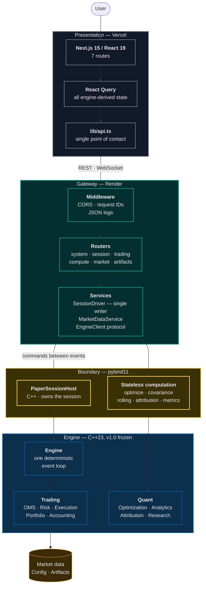

### The invariants this structure enforces

| Invariant | Enforcement |
|:--|:--|
| **The engine owns every trading object** | `Engine`, `PaperSession`, `PaperBroker` and `PaperAccount` are never bound to Python — a test asserts their absence from the module |
| **One writer** | Every mutation is a command the `SessionDriver` applies *between* events; readers consume immutable published snapshots |
| **No lock on the trading path** | Reads come from a snapshot, so opening the interface cannot slow trading |
| **React performs no business logic** | The client plots and sends intent; every statistic comes from the engine |
| **JSON is the only boundary** | Results cross as strings from the engine's own serializers — identical whether in-process or remote |

<br />

### The pybind11 boundary

The most consequential design decision in the project.

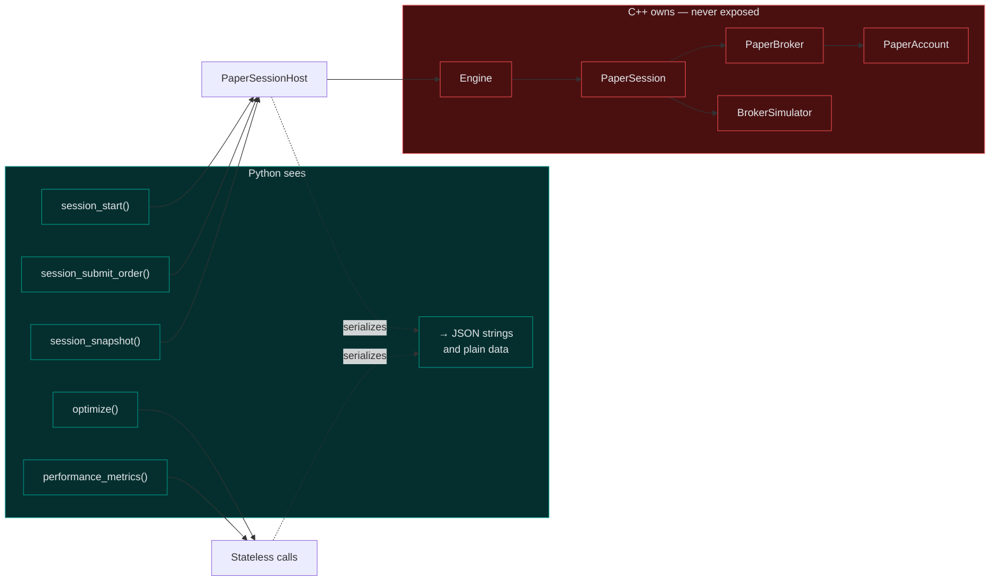

Every non-trivial result crosses as a **JSON string produced by the engine's own serializers**.
This looks like a wasted serialization and buys three things:

- The gateway never holds a pointer into engine memory, so it cannot mutate trading state or
  outlive a borrowed object.
- The wire format is identical whether the engine is in-process or on another machine — moving
  it is a transport swap, not an API rewrite.
- There is no second serializer that could disagree with the engine's.

<br />

---

## Engine architecture

Thirty-four libraries in five layers. Dependencies point downward only.

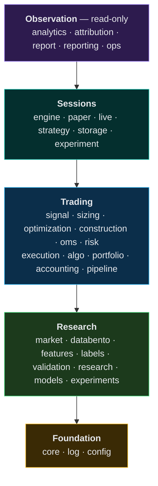

Three consequences worth stating:

- **`ops` observes but is never observed.** No trading module includes it, so instrumentation
  cannot change trading behaviour — verifiable by grep rather than by argument.
- **`strategy` cannot reach the venue.** The catalogue links `core` only.
- **`labels` is not linked into live binaries.** Forward-looking labels exist for research and
  are physically absent from anything that trades.

<br />

### Session lifecycle

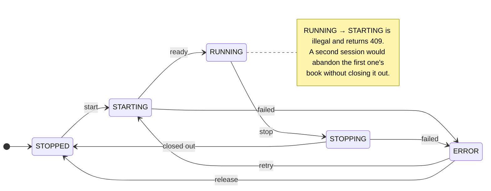

### Engine guarantees

| Component | Guarantee |
|:--|:--|
| **Fills** | `Fill`'s constructor is private; `BrokerSimulator` is its sole friend. Live fills enter through one validated ingress checked against the working order |
| **Orders** | Seven-stage timestamp chain validated at construction; `arrival_time > decision_time` strictly |
| **Risk** | Every order passes the same gate — a manual order is not privileged |
| **Portfolio** | Positions, equity curve and exposures owned by the engine; the gateway reads, never computes |
| **Accounting** | The journal reconciles against the portfolio; the identity is asserted, not assumed |
| **Execution** | Schedules are pure functions of simulated time, so an execution replays exactly |
| **Artifacts** | Round-trip exact with a checksum; a corrupt state is refused, not resumed from |

<br />

<a id="determinism"></a>

### Determinism

```
config hash              30b44e5972450aad
rng[0..2] seed 20240101  d05ef55272cdfb14  2e2f422341add64e  1c120f3d1ce63170
```

> [!IMPORTANT]
> These fingerprints are verified identical at **three layers** — the C++ binary, the Python
> bindings, and the HTTP gateway — and have been unchanged since v1.0.

Guaranteed by a deterministic RNG (no `<random>` distributions, whose implementations differ
between standard libraries) · UTC nanoseconds only · no wall clock on the trading path · ordered
containers in all output · single-threaded by design.

<br />

---

## Request lifecycle

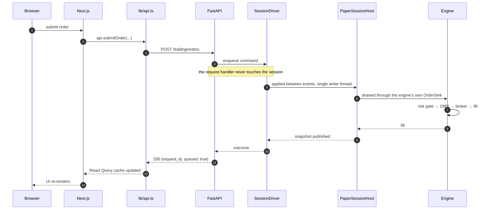

> [!NOTE]
> A `200` means **accepted for submission**, not filled. The order reaches the venue at the next
> market event and faces the same risk gate a strategy's order does — including rejection.

<br />

---

## Trading workflow

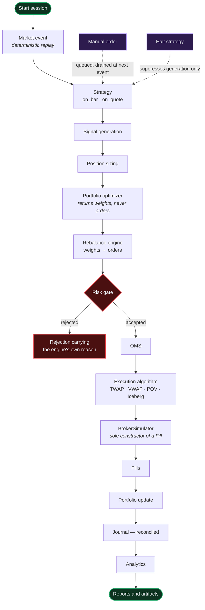

### Three controls at three levels

| Control | Acts on | Effect |
|:--|:--|:--|
| **Flatten** | the **book** | Cancels working orders, then closes every position. The strategy may re-open. |
| **Halt strategy** | the **strategy** | Suppresses order generation. The session runs, data flows, the book marks, manual orders still work. |
| **Stop session** | the **session** | Closes out and tears it down. |

Emergency sequence: **flatten → halt → stop**. Most interfaces blur these; this one does not.

<br />

---

## Quantitative research

| Area | Capability |
|:--|:--|
| **Feature engineering** | Rolling, bivariate, intraday and cross-sectional features, all point-in-time correct |
| **Validation** | Walk-forward splits with purging, embargo, and a locked holdout that records its own unlocking |
| **Models** | OLS and ridge via LDLT, logistic via IRLS — Eigen confined behind a private link |
| **Optimization** | Nine optimizers, five covariance estimators, PSD repair via Jacobi, constraints by projection |
| **Analytics** | `MetricsEngine` (25 fields), rolling volatility, Sharpe, VaR, CVaR, drawdown durations in wall-clock time |
| **Attribution** | Economic P&L decomposition, per-trade execution quality, implementation shortfall split into delay and execution cost |
| **Experiments** | Configs fingerprinted over strategy, dataset, seed and params; comparison engine, leaderboards, checkpointing |
| **Registries** | Append-only dataset registry (checksummed, schema-versioned); model registry with champion/challenger and rollback |

> [!IMPORTANT]
> **The central research invariant:** no model trains on an unknown dataset version. The model
> registry refuses at registration.

<br />

---

## REST API

<div align="center">

**45 endpoints** — 44 REST plus one WebSocket — and **53 schemas**
Interactive documentation at `<backend-url>/docs` · schema at [`frontend/docs/openapi.json`](frontend/docs/openapi.json)

</div>

<details>
<summary><b>System and health</b> &nbsp;<sub>9 endpoints</sub></summary>

<br />

| Method | Endpoint | Purpose |
|:--|:--|:--|
| `GET` | `/` | Service banner |
| `GET` | `/healthz` | Liveness — deliberately does not touch the engine |
| `GET` | `/readyz` | Readiness — are the bindings importable |
| `GET` | `/buildz` | Build metadata: engine version, commit, environment |
| `GET` | `/health` | Liveness plus engine reachability |
| `GET` | `/version` | Engine and gateway versions |
| `GET` | `/system` | Health, version and fingerprints in one call |
| `GET` | `/fingerprints` | Determinism fingerprints |
| `GET` | `/config` | Configuration hash for a config file |

Liveness and readiness are separate on purpose: a liveness probe that fails when a dependency is
degraded causes a restart loop that fixes nothing.

</details>

<details>
<summary><b>Session lifecycle</b> &nbsp;<sub>7 endpoints</sub></summary>

<br />

| Method | Endpoint | Purpose |
|:--|:--|:--|
| `GET` | `/session` · `/session/state` | Current lifecycle state and counters |
| `POST` | `/session/start` | Start a paper session |
| `POST` | `/session/stop` | Stop the running session |
| `POST` | `/session/reset` | Stop, then start a new session |
| `GET` | `/session/snapshot` | Account, positions, orders and fills in one consistent read |
| `GET` | `/session/history` | Sampled equity history and drawdown |
| `GET` | `/session/instruments` | Instruments this session trades |

Reset is stop-then-start, never an in-place reset — discarding a book where it stands would skip
the close-out that reconciles the journal.

</details>

<details>
<summary><b>Trading</b> &nbsp;<sub>8 endpoints</sub></summary>

<br />

| Method | Endpoint | Purpose |
|:--|:--|:--|
| `GET` | `/trading/mode` | Which venue the session trades against |
| `POST` | `/trading/orders` | Submit an order — queued, not filled |
| `GET` | `/trading/orders` | Every order this session has seen |
| `DELETE` | `/trading/orders/{order_id}` | Cancel one order |
| `POST` | `/trading/cancel-all` | Cancel every working order |
| `POST` | `/trading/flatten` | Cancel everything and close every position |
| `POST` | `/trading/halt` | Suppress or resume strategy order generation |
| `GET` | `/trading/pending` | Queued requests and their outcomes |

</details>

<details>
<summary><b>Computation</b> &nbsp;<sub>9 endpoints — stateless</sub></summary>

<br />

| Method | Endpoint | Purpose |
|:--|:--|:--|
| `GET` | `/optimization` | Available optimizers and their requirements |
| `POST` | `/optimization/optimize` | Run one portfolio optimizer |
| `POST` | `/optimization/covariance` | Estimate covariance and correlation |
| `GET` | `/analytics` | Available analytics |
| `POST` | `/analytics/rolling` | Rolling volatility, Sharpe, VaR, CVaR |
| `POST` | `/analytics/performance` | Full performance metrics for an equity series |
| `POST` | `/analytics/attribution/factors` | Beta and alpha contributions |
| `GET` | `/risk` | Risk limits the engine validates |
| `POST` | `/risk/validate` | Semantic validation of a limit set |

**POST does not mean mutate.** These carry a body because their inputs are matrices — a
covariance does not fit in a query string. A test classifies every POST as *lifecycle*,
*trading*, *compute* or *market*, so a mutation path cannot appear unnoticed.

</details>

<details>
<summary><b>Market data</b> &nbsp;<sub>5 endpoints, including WebSocket</sub></summary>

<br />

| Method | Endpoint | Purpose |
|:--|:--|:--|
| `GET` | `/market/status` | Feed mode, connection and watchlist |
| `GET` | `/market/quotes` | Current top of book |
| `POST` | `/market/mode/{mode}` | Select replay or live |
| `POST` | `/market/watchlist` | Replace the watchlist |
| `WS` | `/market/stream` | Streaming quotes |

Switching to live without credentials is refused, never silently downgraded. A panel labelled
LIVE showing synthetic prices would be the most misleading thing this interface could do.

</details>

<details>
<summary><b>Artifacts and reports</b> &nbsp;<sub>7 endpoints</sub></summary>

<br />

| Method | Endpoint | Purpose |
|:--|:--|:--|
| `GET` | `/artifacts` | List persisted artifact keys |
| `GET` | `/portfolio` | Account state from the last persisted snapshot |
| `GET` | `/positions` | Open positions from the last persisted snapshot |
| `GET` | `/diagnostics` | Last persisted live session state |
| `GET` | `/metrics` | Operational metrics from a persisted snapshot |
| `GET` | `/reports` | List available reports |
| `GET` | `/reports/{experiment_id}` | One experiment report |

These serve programmatic clients and are documented in the OpenAPI schema; no screen consumes
them.

</details>

<br />

---

## Technology stack

<table>
<tr><td valign="top" width="50%">

**Languages**

| | |
|:--|:--|
| C++23 | engine (C++20 supported) |
| Python 3.12 | gateway |
| TypeScript 5.7 | frontend, strict mode |

**Frameworks**

| | |
|:--|:--|
| FastAPI | REST and WebSocket gateway |
| Next.js 15 | App Router |
| React 19 | user interface |
| TailwindCSS 3 | dark institutional theme |

**Libraries**

| | |
|:--|:--|
| pybind11 | JSON boundary bindings |
| Eigen 3 | linear algebra for models |
| toml++, CLI11 | configuration, CLI |
| SQLite, nlohmann/json | storage, decoding |
| TanStack Query | engine-derived state |
| Recharts | equity, drawdown, distribution |

</td><td valign="top" width="50%">

**Testing**

| | |
|:--|:--|
| Catch2 v3 | 766 engine tests |
| pytest | 168 gateway tests |
| Vitest, Testing Library | 56 frontend tests |
| Google Benchmark | 147 benchmarks |
| ASan, UBSan | sanitizers and leak detection |

**Build and infrastructure**

| | |
|:--|:--|
| CMake ≥ 3.24, Ninja | engine build |
| Docker | multi-stage, non-root |
| Docker Compose | local production parity |

**Deployment**

| | |
|:--|:--|
| Render | backend, via Docker |
| Vercel | frontend |
| GitHub Actions | continuous integration |
| OpenAPI 3.1 | generated schema |

</td></tr>
</table>

<br />

---

## Repository statistics

<div align="center">

<table>
<tr>
<td align="center" width="25%"><h3>57,168</h3><sub>Engine C++ lines<br/>106 headers · 83 sources</sub></td>
<td align="center" width="25%"><h3>6,973</h3><sub>Gateway Python lines<br/>35 files</sub></td>
<td align="center" width="25%"><h3>4,719</h3><sub>Frontend TS/TSX lines<br/>36 files</sub></td>
<td align="center" width="25%"><h3>1,794</h3><sub>Binding C++ lines<br/>standalone project</sub></td>
</tr>
</table>

<table>
<tr>
<td align="center" width="16%"><h3>9</h3><sub>Optimizers</sub></td>
<td align="center" width="16%"><h3>6</h3><sub>Execution algos</sub></td>
<td align="center" width="16%"><h3>53</h3><sub>API schemas</sub></td>
<td align="center" width="16%"><h3>147</h3><sub>Benchmarks</sub></td>
<td align="center" width="16%"><h3>7</h3><sub>Frontend routes</sub></td>
<td align="center" width="16%"><h3>4</h3><sub>Active ADRs</sub></td>
</tr>
</table>

</div>

<br />

---

## Performance

<table>
<tr><td valign="top" width="50%">

**Hot path** — cost per event

| Operation | Cost |
|:--|--:|
| Suppressed log line | `0.5 ns` |
| Deterministic RNG | `1.2 ns` |
| Operational metric increment | `5.5 ns` |
| Portfolio apply fill | `11.6 ns` |
| Signal generation | `14.3 ns` |
| TWAP child generation | `26.0 ns` |

</td><td valign="top" width="50%">

**Cadence path** — per request or rebalance

| Operation | Cost |
|:--|--:|
| Full session snapshot | `0.27 ms` |
| Live order routing | `2.1 µs` |
| Mean-variance, 50 assets | `456 µs` |
| End-to-end optimization, 50 assets | `1.19 ms` |

<sub>A full snapshot covers account, equity history and blotter — roughly 3,700 reads per second.</sub>

</td></tr>
</table>

> [!WARNING]
> These establish **scaling and relative cost, not production latency.** Measured with Google
> Benchmark on GCC 13 / x86-64 in a shared container — the wrong place to measure a p99.
> Repeated runs vary by 20–25%.

Behind the numbers: a single-threaded engine with no allocation on the hot path · gateway reads
served from immutable snapshots, so no lock sits on the trading path · React Query with a short
stale time and refetch-on-focus · Docker multi-stage keeping the toolchain out of the runtime
image.

<br />

---

## Getting started

**Prerequisites** — CMake ≥ 3.24 · a C++20 compiler (C++23 preferred) · Eigen 3 · Python 3.12 · Node 22

```bash
sudo apt install libeigen3-dev ninja-build   # Debian/Ubuntu
brew install eigen ninja                     # macOS
```

<details open>
<summary><b>Engine only</b> — requires no Python, Node or frontend dependency</summary>

<br />

```bash
git clone https://github.com/Dev2943/predictive-trading-lab
cd predictive-trading-lab

cmake --preset linux-gcc-release
cmake --build build/linux-gcc-release
ctest --test-dir build/linux-gcc-release        # 766 tests

./build/linux-gcc-release/apps/ptl_version -c config/base.toml
# config hash must read 30b44e5972450aad
```

Available presets: `linux-gcc-release` · `linux-clang-debug` · `macos-debug` · `macos-release` ·
`asan-ubsan` · `coverage` · `benchmark`.

</details>

<details>
<summary><b>Full stack</b> — engine, gateway and workstation</summary>

<br />

```bash
# 1. Bindings — a standalone CMake project; the repository root is unchanged
pip install -r frontend/backend/requirements.txt
cmake -S frontend/backend/bindings -B build/bindings -G Ninja \
      -DCMAKE_BUILD_TYPE=Release \
      -Dpybind11_DIR=$(python3 -c "import pybind11; print(pybind11.get_cmake_dir())")
cmake --build build/bindings

# 2. Gateway
cd frontend/backend
PYTHONPATH=../../build/bindings/lib uvicorn app.main:app --reload

# 3. Workstation
cd frontend/web && npm install && npm run dev
```

</details>

<details>
<summary><b>Docker</b> — the fastest path to a running stack</summary>

<br />

```bash
# From the repository root — the backend build context is the root,
# because the bindings compile against the engine.
docker compose -f frontend/docker-compose.yml up --build
```

Workstation on `:3000`, gateway on `:8000`.

</details>

<br />

---

## Docker

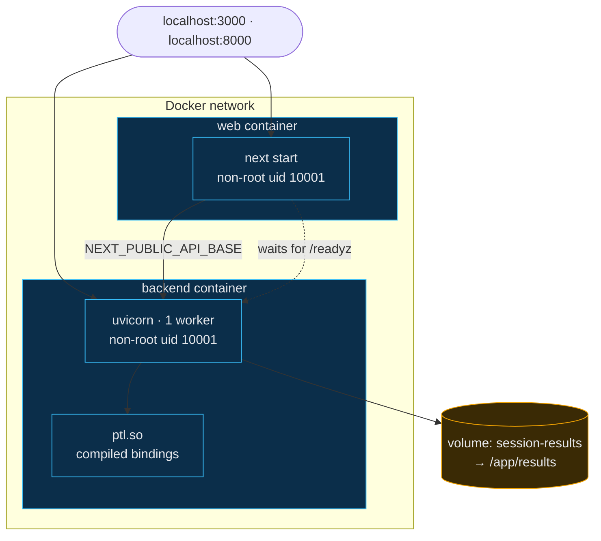

The backend image is multi-stage. **Stage one** installs GCC, CMake, Ninja and Eigen and compiles
the engine; **stage two** ships only Python, the gateway and a single shared object of roughly
1.5 MB. Both containers run as non-root with health checks, and the web container waits on the
backend's readiness probe.

<br />

---

## Continuous integration

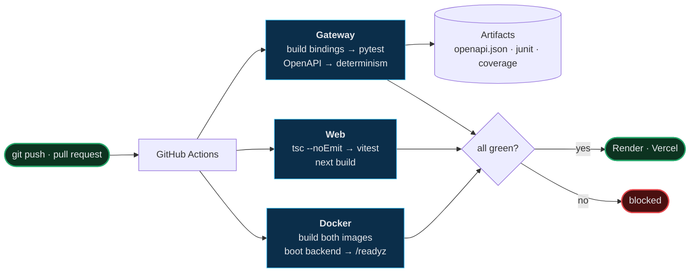

- The gateway job **builds the C++ bindings before running tests** — without them the integration
  tests skip and the job would pass while proving much less.
- OpenAPI generation **fails the build** if any endpoint lacks a summary.
- Determinism fingerprints are asserted against the v1.0 reference on every run.

The workflow lives at `frontend/ci/frontend-ci.yml`; GitHub reads workflows from
`.github/workflows/`, so it is installed by copying it there. Every development phase kept its
changes inside `frontend/`.

<br />

---

## Deployment

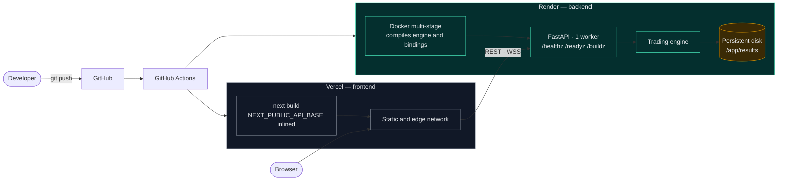

> [!IMPORTANT]
> **One instance, one worker — by design.** The paper session lives in memory with a single
> writer thread. A second replica would be a second session, and a client's requests would land
> on whichever one the load balancer chose. Scaling means redesigning session ownership, not
> raising a replica count.

<details>
<summary><b>Why Render</b>, compared against the alternatives</summary>

<br />

| Platform | Assessment |
|:--|:--|
| **Render** | **Chosen.** Native Docker with a build timeout long enough to compile the engine, WebSockets with no configuration, an attachable disk, and an adequate free tier |
| Fly.io | Technically the closest match — a single stateful machine with a volume is exactly this shape — but `fly.toml`, regions and machine lifecycle are more for a reviewer to learn |
| Railway | Comparable ergonomics, but no durable free tier, so a public demonstration would lapse |

</details>

<details>
<summary><b>Backend → Render</b></summary>

<br />

1. New **Web Service** → your repository → **Docker**
2. Dockerfile path `frontend/backend/Dockerfile`, **Docker context `.`**
   — the repository root, because the engine source must be in the build context
3. Instance: 512 MB or larger; the C++ build needs headroom
4. Health check path: `/readyz`
5. Environment:

   ```env
   PTL_ENV=production
   PTL_ALLOWED_ORIGINS=https://predictive-trading-lab.vercel.app
   PTL_LOG_LEVEL=info
   PTL_RESULTS=/app/results
   PTL_MARKET_PROVIDER=replay
   ```

6. Attach a disk at `/app/results` for sessions to survive restarts

</details>

<details>
<summary><b>Frontend → Vercel</b></summary>

<br />

1. Import the repository with **Root Directory** `frontend/web`
2. Set `NEXT_PUBLIC_API_BASE` to the Render service URL
3. Deploy

`NEXT_PUBLIC_*` is inlined at build time, so changing the API URL requires a redeploy rather than
a restart — the most common Next.js deployment confusion.

</details>

<details>
<summary><b>Environment variables</b></summary>

<br />

| Variable | Default | Purpose |
|:--|:--|:--|
| `PTL_ENV` | `development` | `production` refuses debug mode, localhost origins and wildcard CORS |
| `PTL_HOST` · `PORT` | `0.0.0.0` · `8000` | Bind address; `PORT` is honoured for platform injection |
| `PTL_LOG_LEVEL` | `info` | Gateway log level |
| `PTL_ALLOWED_ORIGINS` | localhost | Comma-separated CORS origins |
| `PTL_RESULTS` | `results` | Session artifact directory |
| `PTL_CONFIG` | `config/base.toml` | Engine configuration path |
| `PTL_MARKET_PROVIDER` | `replay` | `replay` or `alpaca` |
| `PTL_ALPACA_KEY` · `PTL_ALPACA_SECRET` | — | Live market data credentials; never logged |
| `NEXT_PUBLIC_API_BASE` | `http://localhost:8000` | Inlined at build time |

The gateway refuses to start on a bad configuration, reporting every problem at once with a
remedy, rather than starting and serving errors that look healthy to a load balancer.

Reference: [`frontend/.env.example`](frontend/.env.example) ·
full guide: [`frontend/DEPLOYMENT.md`](frontend/DEPLOYMENT.md)

</details>

<details>
<summary><b>Verifying a deployment</b></summary>

<br />

```bash
curl https://<service>.onrender.com/readyz        # {"ready": true}
curl https://<service>.onrender.com/buildz        # engine version, commit, environment
curl https://<service>.onrender.com/fingerprints  # config_hash 30b44e5972450aad
```

The WebSocket URL is derived from the API origin, so an `https` API automatically yields `wss`
and cannot produce the mixed-content failure browsers report only in the console.

</details>

<br />

---

## Testing

<div align="center">

| Suite | Count | Covers |
|:--|:--:|:--|
| **Engine** | **766** | unit · property · **leakage** · golden · integration |
| **Gateway** | **168** | mock `EngineClient` and real-engine integration |
| **Frontend** | **56** | components, streaming, accessibility, error states |
| **Benchmarks** | **147** | all build and run |
| **Total** | **990** | |

</div>

```bash
ctest --test-dir build/linux-gcc-release                # engine
PYTHONPATH=build/bindings/lib pytest frontend/backend    # gateway
cd frontend/web && npm test                              # frontend
```

> [!IMPORTANT]
> **Leakage tests are the ones that matter most.** They assert that information which should not
> be available *is* not: that a covariance estimated to time *T* is bit-identical whether or not
> later data sits in the caller's buffer; that a walk-forward fold cannot see past its boundary;
> that a paper session reproduces a backtest exactly.

Several tests assert **exact** floating-point equality rather than a tolerance. Float summation
is not associative, so any change in iteration order shows in the last bit — an approximate
comparison would pass through exactly the reordering those tests exist to catch.

Verified across GCC 13 and Clang 18, in Debug, RelWithDebInfo with `-Werror`, ASan and UBSan with
leak detection, C++20, C++23, and with the `Result<T>` fallback storage.

<br />

---

## Security

| Concern | Measure |
|:--|:--|
| **CORS** | Configured per deployment. Production refuses `localhost` and wildcard origins at startup |
| **Security headers** | `X-Content-Type-Options`, `X-Frame-Options: DENY`, `Referrer-Policy` |
| **Caching** | Build assets immutable; every page `no-store` — a cached dashboard would show a stale book as current |
| **Container isolation** | Both images run as non-root, uid 10001, with health checks |
| **Configuration validation** | Fail-fast at startup, every problem reported with a remedy |
| **Input validation** | Pydantic on every request; symbols containing punctuation are refused rather than sanitised, because rewriting hides whether it was a typo or an attack |
| **Path traversal** | Artifact keys containing `..` are refused |
| **Secrets** | Read from the environment only; never logged, echoed or returned, not even masked |
| **Debug mode** | Cannot be enabled in production; the validator rejects it |

<br />

---

## Project structure

<details>
<summary><b>Full tree</b></summary>

<br />

```
predictive-trading-lab/
│
├── include/ptl/               Engine public headers · 106 files · 34 modules
│   ├── core/                    named types, Result<T>, DeterministicRng, UTC time
│   ├── market/  databento/      calendars, bars, quotes, replay source, providers
│   ├── engine/                  Engine, IStrategy, StrategyContext, OrderSink
│   ├── oms/  risk/              order lifecycle · pre-trade gate
│   ├── execution/  algo/        BrokerSimulator, cost and latency models · 6 algorithms
│   ├── portfolio/ accounting/   positions, equity curve · journal, trade matching
│   ├── optimization/            9 optimizers, covariance estimators, constraints
│   ├── analytics/ attribution/  MetricsEngine, drawdown, rolling · P&L decomposition
│   ├── features/ labels/        point-in-time features · forward-looking labels
│   ├── validation/ research/    walk-forward splits, purging, embargo, holdout
│   ├── models/                  OLS, ridge, logistic behind a private Eigen link
│   ├── signal/ sizing/          signal generation · position sizing
│   ├── construction/ pipeline/  rebalancing · orchestration
│   ├── strategy/ storage/       lifecycle registry · dataset and model registries
│   ├── paper/ live/             PaperSession · LiveSession, broker adapters
│   ├── experiment/ experiments/ reproducible configs, comparison, leaderboards
│   ├── ops/                     health, metrics, circuit breakers, watchdogs
│   ├── report/ reporting/       typed reports, visualization datasets
│   ├── auth/ log/ config/       credentials, structured logging, TOML configuration
│
├── src/                       Engine implementation · 83 files · mirrors include/
├── apps/                      ptl_gate — entitlement probe · ptl_version — fingerprints
├── tests/                     766 tests: unit · property · leakage · golden · integration
├── benchmarks/                147 Google Benchmark micro-benchmarks
├── examples/                  Compiled example programs, built in CI
├── docs/                      Engine architecture, ADRs, reproducibility, limitations
├── cmake/ config/ tools/      Build helpers · TOML configuration · developer scripts
│
└── frontend/                  Everything web-facing. The engine never depends on this.
    ├── backend/
    │   ├── bindings/            pybind11 module and PaperSessionHost, standalone CMake
    │   ├── app/
    │   │   ├── main.py            FastAPI app, lifespan, health probes
    │   │   ├── settings.py        environment configuration, fail-fast validation
    │   │   ├── observability.py   JSON logging, request IDs
    │   │   ├── dependencies.py    singletons: engine client, session driver, market
    │   │   ├── engine/            EngineClient protocol, SessionDriver, broker adapters
    │   │   ├── market/            provider boundary, replay and Alpaca live, service
    │   │   ├── routers/           system · session · trading · compute · market · artifacts
    │   │   └── models/            pydantic wire models — 53 schemas
    │   ├── tests/               168 tests, mock-based and real-engine integration
    │   └── Dockerfile           multi-stage: compiles the engine, ships a slim runtime
    ├── web/
    │   ├── app/                 7 routes, App Router
    │   ├── components/          dashboard, charts, navigation, feedback, connection
    │   ├── lib/api.ts           the single point of contact with the gateway
    │   ├── tests/               56 Vitest and Testing Library tests
    │   ├── Dockerfile           production build for compose parity
    │   └── vercel.json          headers and caching policy
    ├── docs/                  Phase architecture notes and openapi.json
    ├── ci/frontend-ci.yml     CI workflow
    ├── docker-compose.yml     Local stack reproducing production
    ├── DEPLOYMENT.md          Full deployment guide
    └── .env.example           Every configurable value
```

</details>

<br />

---

## Development history

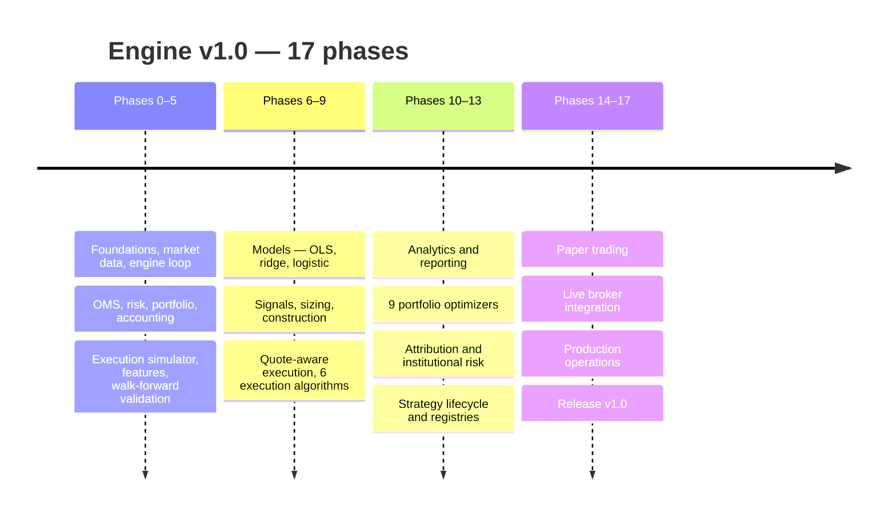

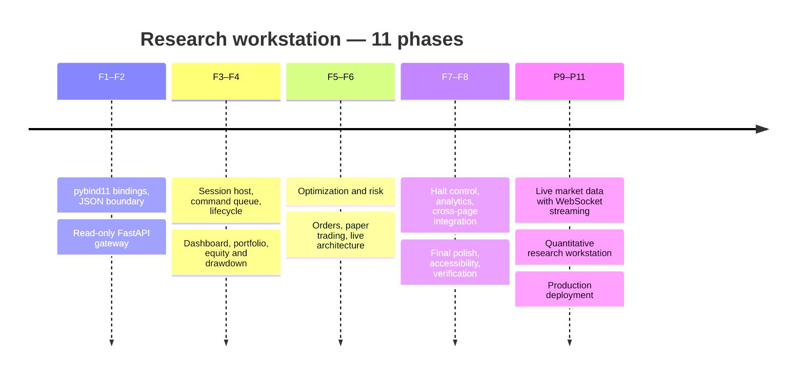

> Every phase was verified before the next began. **The engine has been byte-identical since
> v1.0** — checked at every phase boundary, not merely left alone.

Phase notes: [`frontend/docs/`](frontend/docs/) ·
decisions: [`docs/adr/`](docs/adr/) ·
history: [`CHANGELOG.md`](CHANGELOG.md)

<br />

---

## Known limitations

> Stated plainly. A platform that hides these is harder to trust than one that does not.

**Unverified against production conditions**

- **Market data is a deterministic synthetic replay**, labelled `synthetic-replay` everywhere it
  surfaces. ADR-0001's entitlement has never been verified against a live account.
- **No live broker connection has ever been made.** The Alpaca order translator is tested against
  a scripted transport; `LiveBrokerAdapter` raises on every method and never falls back to paper.
- **The Alpaca market data client is unverified against a real endpoint.** Its message handling is
  tested against a fake speaking Alpaca's documented shapes; its connection handling is not.

**Architectural limits**

- **The backend is stateful and single-instance.** Sessions do not survive a restart without an
  attached disk.
- **Manual order timing is not replayable.** Ordering *within* a bar is deterministic — manual
  requests FIFO, then strategy orders — but which bar a human's order lands on depends on
  wall-clock arrival.
- **Single-threaded by design.** Throughput is bounded by one core, a deliberate trade for
  determinism.
- **Fill simulation is conservative, not queue-position based** (ADR-0003), so fill rates for
  passive strategies are understated.

**Absent capabilities**

- **No sector data**, so sector attribution is impossible without inventing it.
- **No classical technical indicators.** Adding them in Python would put financial calculations in
  the wrong layer; they belong in the engine, which is frozen.
- **Benchmark-relative statistics** — Information Ratio, Beta, Alpha, Tracking Error — require a
  benchmark instrument the system does not have.
- **Some API endpoints have no user interface.** Persisted artifacts, diagnostics, metrics and
  reports serve programmatic clients only.

<br />

---

## Roadmap

- [ ] Close ADR-0001's market data entitlement against a real account
- [ ] Verify the Alpaca live feed against a real endpoint
- [ ] Journal manual commands against event indices, making a human-driven session fully replayable
- [ ] Bind the engine's trade matching so the blotter can show MAE and MFE per round trip
- [ ] Interactive Brokers adapter — one `IOrderTranslator`, nothing else changes
- [ ] Queue-position fill modelling, if order-by-order data becomes available

<br />

---

## Contributing

> A change is ready when it would survive review by someone who will be paged at 3am if it is
> wrong.

1. Fork and branch from `main`
2. Follow [`CONTRIBUTING.md`](CONTRIBUTING.md) and [`docs/developing.md`](docs/developing.md)
3. Add a test whose **name states the property**, not the mechanics
4. Run the verification below
5. Open a pull request describing *why*, not only *what*

```bash
find include src apps tests benchmarks examples \( -name '*.hpp' -o -name '*.cpp' \) \
  -print0 | xargs -0 clang-format --dry-run --Werror

cmake --preset asan-ubsan && cmake --build build/asan-ubsan
ctest --test-dir build/asan-ubsan

./build/asan-ubsan/apps/ptl_version -c config/base.toml   # fingerprints unchanged
```

<details>
<summary><b>What will be rejected</b></summary>

<br />

- **A second implementation of something that exists.** Two definitions of Sharpe is how two
  reports of the same run come to disagree.
- **Silent downgrades.** Refuse an order the venue cannot express rather than sending something
  adjacent.
- **Wall clock or `<random>` on the trading path.** CI greps for both.
- **A test that asserts what the code does** rather than what it must guarantee.

A fingerprint change is either a bug or a deliberate decision that belongs in an ADR. It is never
incidental.

</details>

<br />

---

## License

This repository does not include a license file. All rights are reserved by the author, and the
code is not licensed for reuse or redistribution.

<br />

<div align="center">

**Predictive Trading Lab**

<sub>Deterministic by construction · honest about its limits</sub>

<br />

[Live Demo](https://predictive-trading-lab.vercel.app/) ·
[Architecture](frontend/docs/) ·
[Decisions](docs/adr/) ·
[Changelog](CHANGELOG.md)

</div>
