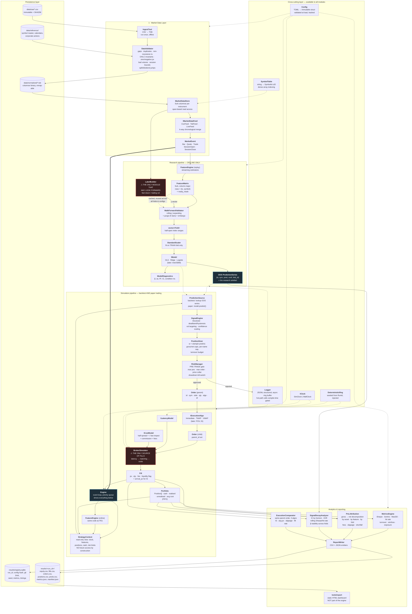
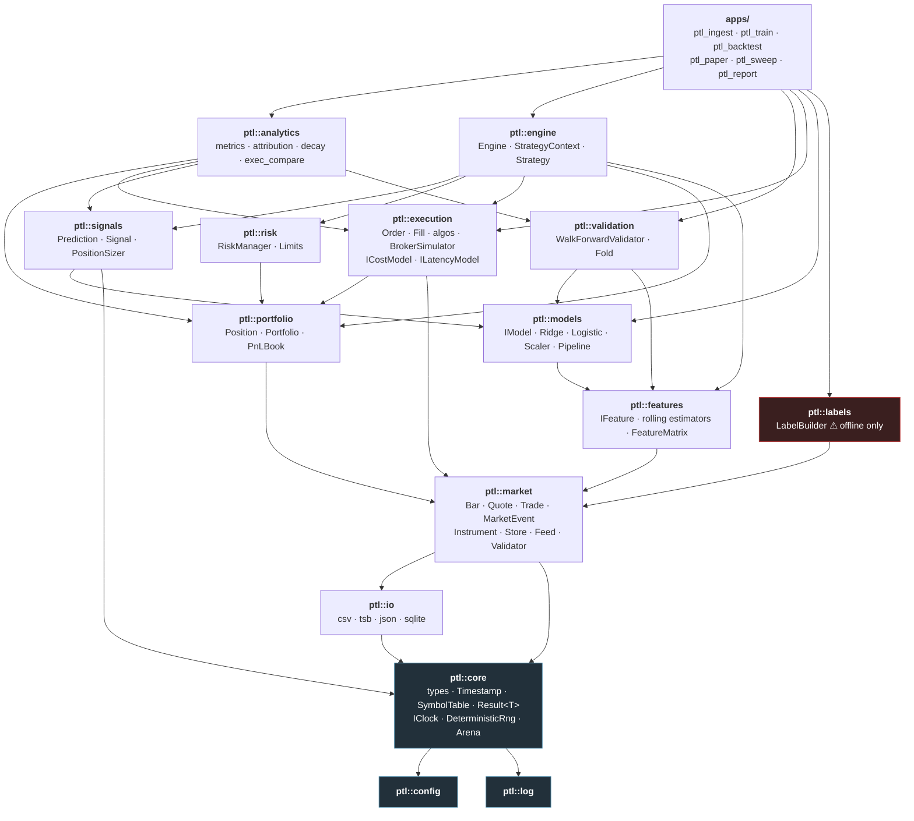

# Phase 0 — System Design & Architecture

**Project:** Predictive Trading Research Lab (`ptl`)
**Scope of this document:** architecture only. No implementation.

> An end-to-end quantitative research and execution simulation platform designed to explore
> statistical signals, walk-forward validation, transaction-cost-aware backtesting, and
> execution algorithms. Written in C++20 with a thin reporting layer.

---

## 0. Executive summary of the design

Almost every "quant backtest project" on GitHub fails for one of four reasons. This architecture
is organised around structurally preventing all four:

| Failure mode | Structural defence in this design |
|---|---|
| **Lookahead bias** — the model sees the future | Features are *streaming/online* estimators with no random access to the series. Label construction lives in a physically separate module that the live path cannot reach. Every record carries `event_time` **and** `available_time`. |
| **Research/live divergence** — backtest code ≠ live code | One `Engine`, one `StrategyContext`, two `Clock` implementations. `ptl_backtest` and `ptl_paper` are ~40-line `main()` files that differ only in which feed and clock they construct. |
| **Fantasy fills** — everything fills at last price, free | All costs enter at exactly one place: `BrokerSimulator` via `ICostModel` + `ILatencyModel`. Signal and portfolio layers physically cannot fabricate a fill. |
| **Unreproducible results** | `RunId = hash(config ‖ data checksum ‖ git SHA ‖ seed)`. All randomness injected. A determinism test byte-compares two runs. |

The three most consequential decisions in this document:

1. **Streaming features** (§4) — makes lookahead a compile-time-ish impossibility rather than a code-review problem, *and* makes backtest and live identical for free.
2. **Cache the feature matrix and the out-of-sample prediction series** (§11) — the single biggest performance win in the system, and it is architectural, not micro-optimisation. It is worth ~100× more than any amount of SIMD in the inner loop.
3. **Execution-algo research must run on intraday bars** (§13) — TWAP vs VWAP vs Immediate is *meaningless* on daily bars. This constrains the dataset choice and it is better to know now than in Phase 8.

---

## 1. What the system actually is

It is two pipelines sharing one runtime.

**Pipeline A — Research (offline, may look at the whole history at once):**

```
raw data → validate → normalise → features → labels → walk-forward folds
         → fit model per fold → out-of-sample prediction series
```

Only this pipeline is permitted to touch the future, and only through `ptl::labels`.
Its sole output artefact is a **series of point-in-time out-of-sample predictions**, each stamped
with the timestamp at which it would have been knowable.

**Pipeline B — Simulation (online, sees only the past, replayed or live):**

```
event feed → engine loop → features → prediction (from A, or model.predict live)
           → signal → target position → orders → exec algo → broker sim → fills
           → portfolio → P&L → analytics
```

Backtesting and paper trading are the *same* pipeline B. The only difference is whether the
`Clock` advances from event timestamps (`SimClock`) or from the wall clock (`WallClock`), and
whether the feed reads a file or polls an API.

This split is the whole architecture. Everything below is detail.

---

## 2. Architecture flowchart



**Reading the diagram:**

- **Solid arrows** = data flow. **Dotted arrows** = configuration, injection, or cached reuse.
- Two nodes are marked red because they are the two places where the system can lie to you.
  `LabelBuilder` is the only code allowed to index forward in time. `BrokerSimulator` is the only
  code allowed to create a `Fill`. Every code review focuses on those two files.
- Note that `RES` feeds `SIM` **only** through `OOS PredictionSeries`. There is no other edge.
  That is what makes the backtest honest.

---

## 3. Lifecycle of a single observation → P&L attribution

This traces one bar for one symbol from the CSV row to its line in the attribution report.

```mermaid
flowchart TB

A["<b>T0 · Raw row</b><br/><code>AAPL,2023-06-14,185.10,187.20,184.55,186.90,52104300</code><br/>in data/raw/aapl.csv"]

B["<b>T0 · Parse</b> — CsvParser<br/>mmap + std::from_chars, zero-copy fields<br/>→ Bar{ open_time, close_time, o,h,l,c, v }"]

C["<b>T0 · Validate</b> — DataValidator<br/>✓ close_time &gt; previous close_time<br/>✓ low ≤ min(o,c) ≤ max(o,c) ≤ high<br/>✓ all px &gt; 0, volume ≥ 0<br/>✓ inside session calendar<br/>✓ |log(c/c_prev)| &lt; 0.5 unless corp action"]

D["<b>T0 · Normalise & persist</b><br/>SymbolId=42 (interned)<br/>appended to columnar .tsb block<br/><i>done once, ever</i>"]

E["<b>T1 · Replay</b> — TsbFeed emits<br/>MarketEvent{ tag=Bar, ts=2023-06-14 16:00:00 ET }<br/>into Engine's chronological queue"]

F["<b>T1 · Feature update</b> — FeatureEngine::on_bar()<br/>Each estimator gets O(1) update, no history access:<br/>ret1 · ret5 · ret20 · RollingMean(20) · Welford σ(20)<br/>zscore · RSI(14, Wilder) · ATR(14) · RV(20)<br/>volume_z(60) · turnover<br/>→ FeatureVector{ asof=16:00:00, sym=42, x[0..24], ready_mask }"]

G{"<b>ready_mask == full?</b><br/>longest warmup = 60 bars"}
G -- no --> GX["Emit nothing.<br/>Row excluded from training<br/>and from live trading."]

H["<b>T1 · available_time stamp</b><br/>available_time = close_time + data_delay<br/>(config: 0 for close bars, +1s for live feed)<br/>⛔ consumer asserts available_time ≤ clock.now()"]

subgraph OFF["OFFLINE PATH — research only"]
  I["<b>LabelBuilder</b> ⚠ looks forward<br/>y = log(c[t+1]/c[t]) / σ_trailing[t]<br/>winsorised at ±4σ<br/><i>only reachable from ptl_train</i>"]
  J["<b>Row lands in fold</b><br/>ts=2023-06-14 → test window of fold 5<br/>(train 2019-01→2022-12, purge 1 bar,<br/>embargo 5 bars, test 2023)<br/>⛔ this row is NOT in fold 5's train set"]
  K["<b>Scaler + Model</b><br/>StandardScaler fitted on fold 5 TRAIN ONLY<br/>Ridge β from fold 5 TRAIN ONLY<br/>pred = β·z(x) = +0.0182"]
  L["<b>PredictionSeries row</b><br/>{ ts=2023-06-14 16:00, sym=42,<br/>pred=+0.0182, conf=0.61, fold=5 }<br/>persisted to results/&lt;run&gt;/preds.csv"]
end

F --> G
G -- yes --> H
H --> I --> J --> K --> L
H --> M

M["<b>T2 · Signal</b> — SignalEngine<br/>pred=+0.0182 vs threshold=0.010 → LONG<br/>deadband: |Δw| &lt; 0.15·w_cur → suppressed?  no<br/>Signal{ raw=0.0182, z=1.34, dir=+1 }"]

N["<b>T2 · Size</b> — PositionSizer<br/>w_raw = k·pred/σ_20 = 0.0182/0.0143·0.25 = 0.318<br/>per-name cap 0.05 → w = 0.050<br/>gross cap 1.0 across book → w = 0.043<br/>target_qty = 0.043·NAV/186.90 = +229 sh<br/>current = +160 sh → <b>Δ = +69 sh</b>"]

O{"<b>T2 · RiskManager</b><br/>pre-trade gate"}
O -- reject --> OX["Log rejection with reason code.<br/>No order. Counted in attribution<br/>as 'risk-suppressed opportunity'."]

P["<b>T2+Δ · Parent Order</b><br/>Order{ id=8891, sym=42, BUY 69,<br/>algo=VWAP, tif=DAY,<br/>created=2023-06-15 09:30:00 }<br/>⛔ NOT 06-14 — decision on close t,<br/>execution starts t+1. No same-bar fill."]

Q["<b>T2+Δ · Exec algo</b> — VwapAlgo<br/>historical U-curve profile for sym 42<br/>slices 69 into child orders by bucket:<br/>09:30–10:00 → 12 · 10:00–11:00 → 9 · …<br/>15:30–16:00 → 14"]

R["<b>T3 · Child order</b><br/>Order{ id=8891-c03, parent=8891,<br/>BUY 9, MARKET, sent=11:00:00.000 }"]

S["<b>T3 · Latency</b> — ILatencyModel<br/>decision→wire  ~250 µs<br/>wire→exchange  ~900 µs (± jitter, seeded RNG)<br/>effective arrival ts = 11:00:00.00115"]

T["<b>T3 · Matching</b> — BrokerSimulator<br/>reference px = bar VWAP or mid at arrival<br/>participation cap: qty ≤ 10% of bar volume<br/>→ 9 ≤ cap, full fill"]

U["<b>T3 · Cost model</b> — ICostModel<br/>half_spread = 1.2 bps → +0.0224<br/>impact = η·σ_d·√(Q/ADV) = 0.4·0.021·√(9/5.2e7)<br/>            ≈ 0.11 bps → +0.0021<br/>commission = max(0.0035·9, 0.35) = $0.35<br/>fill_px = 187.05 + 0.0245 = <b>187.0745</b>"]

V["<b>T3 · Fill</b><br/>Fill{ order=8891-c03, ts=11:00:00.00115,<br/>px=187.0745, qty=9, fee=0.35,<br/>arrival_px=186.90, liq=TAKER }"]

W["<b>T3 · Portfolio</b><br/>position 42: 160 → 169 sh<br/>avg_cost 184.22 → 184.37<br/>cash −= 9·187.0745 + 0.35 = −1,684.02<br/>unrealised = 169·(mark − 184.37)"]

X["<b>T4 · Mark to market</b> (each close)<br/>daily_pnl = Δ(position·mark) + realised − fees<br/>appended to equity.csv"]

Y["<b>T5 · Attribution</b> — PnLAttribution<br/>─ by asset:   AAPL contributed +$412<br/>─ by feature: pred = Σβⱼxⱼ, so<br/>   ret20 share 41% → +$169<br/>   zscore share 27% → +$111 … <br/>─ implementation shortfall vs 186.90 arrival:<br/>   delay −$8.10 · impact −$0.22 · fees −$2.10<br/>   unfilled opportunity −$0.00<br/>─ by fold: fold 5 OOS Sharpe 0.71"]

Z["<b>T5 · Decay</b> — SignalDecayAnalyzer<br/>this pred joins rolling IC(h=1) window<br/>IC_60d = 0.031 → 0.019 over 2023<br/>flagged: decaying"]

P1["<b>results/&lt;run_id&gt;/</b><br/>fills.csv · equity.csv · attribution.json<br/>+ row in registry.sqlite"]

M --> N --> O
O -- pass --> P --> Q --> R --> S --> T --> U --> V --> W --> X --> Y --> Z --> P1

classDef warn fill:#3a1f1f,stroke:#c04040,stroke-width:2px,color:#fff
classDef gate fill:#3a331f,stroke:#c0a040,stroke-width:2px,color:#fff
class I warn
class G,O,H gate
```



**The five gates on this path** — each is a place where a naive implementation leaks the future
or fabricates profit:

1. **`ready_mask` gate** — a feature that has not seen its full warmup window emits nothing.
   Prevents "the first 60 rows of the backtest are garbage but still traded."
2. **`available_time` assertion** — consumers assert `available_time <= clock.now()`. This is the
   single line that catches most leaks. It should be an `assert` in debug and a counter in release.
3. **Fold membership** — the row's own bar is in the *test* window; the model that scored it was
   fitted on data strictly before the purge boundary.
4. **Decision-time / execution-time split** — decision stamped `06-14 16:00`, order created
   `06-15 09:30`. There is no code path that produces a fill at the decision bar's close.
5. **Risk gate** — rejected orders are logged with a reason code and counted, not silently dropped.
   Otherwise your backtest quietly stops matching your paper trading.

---

## 4. Component dependency diagram

Strict layering: **arrows point downward only.** A cyclic include is a build error, enforced by
one CMake target per module with explicit `target_link_libraries`.



Two rules worth stating explicitly in the README:

- **`ptl::labels` has no reverse dependency.** Nothing in `engine`, `signals`, `execution`, or
  `portfolio` may link against it. `ptl_backtest` and `ptl_paper` do not link it at all — so a
  lookahead leak through labels is a *linker error*, not a subtle bug.
- **`ptl::models` depends on `ptl::features`, never the reverse.** Features never know what they
  are predicting. This keeps the feature library reusable and untainted.

---

## 5. Core types and interfaces

Declarations only. Bodies come in later phases.

### 5.1 `ptl::core`

```cpp
namespace ptl {

// Strong typedefs via a small NamedType wrapper — prevents Price/Qty mixups
// without dragging in a units library.
using Price = NamedType<double, struct PriceTag,   Arithmetic, Comparable>;
using Qty   = NamedType<double, struct QtyTag,     Arithmetic, Comparable>;
using Bps   = NamedType<double, struct BpsTag,     Arithmetic, Comparable>;
using Notional = NamedType<double, struct NotionalTag, Arithmetic, Comparable>;

// Symbols are interned to a dense u32 so hot structs stay small and
// per-symbol state is a flat array lookup, not a hash map.
enum class SymbolId : std::uint32_t {};
class SymbolTable {                       // built once at load, then read-only
public:
    SymbolId intern(std::string_view);
    std::string_view name(SymbolId) const noexcept;
    std::size_t size() const noexcept;
};

using Timestamp = std::chrono::sys_time<std::chrono::nanoseconds>;
using Duration  = std::chrono::nanoseconds;

enum class Side : std::uint8_t { Buy, Sell };

class IClock {
public:
    virtual ~IClock() = default;
    virtual Timestamp now() const noexcept = 0;
};
class SimClock  : public IClock { public: void advance_to(Timestamp); };
class WallClock : public IClock {};

// All randomness flows through here. Seeded from RunId. No global state,
// no std::rand, no thread_local engines.
class DeterministicRng {
public:
    explicit DeterministicRng(std::uint64_t seed) noexcept;
    double uniform01() noexcept;
    double normal(double mean, double sd) noexcept;
    DeterministicRng fork(std::uint64_t stream_id) const noexcept; // per-subsystem streams
};

template <class T, class E = Error>
class Result;   // expected-like; used for parsing/config/IO, NOT the hot loop

} // namespace ptl
```

**Note on `Price = double`.** Doubles are fine for equity research at daily/minute granularity, and
the `NamedType` wrapper gives you type safety without precision games. Fixed-point becomes worth it
if you ever move to sub-penny or crypto with 8 decimals — the `NamedType` alias makes that a
one-line change with a compiler-enforced migration. Document it as a deliberate choice, not an
oversight.

### 5.2 `ptl::market`

```cpp
namespace ptl::market {

struct Instrument {
    SymbolId    id;
    std::string exchange;
    double      tick_size;
    double      lot_size;
    double      adv_20;          // avg daily volume, for the impact model
    std::string currency;
    bool        shortable;
};

struct Bar {
    Timestamp open_time, close_time;
    SymbolId  symbol;
    Price     open, high, low, close;
    Qty       volume;
    Notional  turnover;          // if available, else close*volume
    Timestamp available_time;    // when a live system would have known this
};

struct Quote { Timestamp ts, available_time; SymbolId symbol;
               Price bid, ask; Qty bid_size, ask_size; };

struct Trade { Timestamp ts, available_time; SymbolId symbol;
               Price price; Qty size; Side aggressor; };

// Tagged POD rather than std::variant: fixed 64-byte size, no visitation
// overhead, cache-friendly in the event queue. Benchmark both in Phase 12.
enum class EventTag : std::uint8_t { Bar, Quote, Trade, SessionOpen, SessionClose, Timer };
struct MarketEvent {
    EventTag  tag;
    Timestamp ts;
    SymbolId  symbol;
    union { Bar bar; Quote quote; Trade trade; };
};

class IMarketDataFeed {
public:
    virtual ~IMarketDataFeed() = default;
    virtual bool next(MarketEvent& out) = 0;      // false = exhausted
    virtual Timestamp peek_next_ts() const = 0;   // for k-way merge
};

class MarketDataStore {                            // SoA columnar
public:
    std::span<const Timestamp> timestamps(SymbolId) const noexcept;
    std::span<const double>    closes(SymbolId)     const noexcept;
    std::span<const double>    volumes(SymbolId)    const noexcept;
    const Instrument&          instrument(SymbolId) const noexcept;
};

struct ValidationIssue { Timestamp ts; SymbolId sym; IssueCode code; std::string detail; };
struct ValidationReport { std::vector<ValidationIssue> issues; Stats stats;
                          bool fatal() const noexcept; };
class DataValidator { public: ValidationReport validate(const MarketDataStore&) const; };

} // namespace ptl::market
```

### 5.3 `ptl::features`

The critical interface. Note what is **absent**: no `history()`, no `operator[]`, no series access.

```cpp
namespace ptl::features {

class IFeature {
public:
    virtual ~IFeature() = default;
    virtual void on_bar(const market::Bar&) noexcept = 0;
    virtual void on_quote(const market::Quote&) noexcept {}
    virtual double value() const noexcept = 0;
    virtual bool  ready() const noexcept = 0;
    virtual int   warmup_bars() const noexcept = 0;
    virtual std::string_view name() const noexcept = 0;
    virtual void reset() noexcept = 0;
};

// Concrete estimators — all O(1) update, O(1) or O(window) memory.
class ReturnN;         // log(c_t / c_{t-n})
class RollingMean;     // ring buffer
class RollingStdev;    // Welford, numerically stable — NOT sum-of-squares
class Ewma;
class ZScore;          // (x - mean) / stdev, composed from the above
class Rsi;             // Wilder smoothing
class Atr;             // Wilder smoothing on true range
class RealizedVol;     // sqrt(sum r^2 / n) * sqrt(annualisation)
class VolumeZScore;
class Turnover;
class MaDeviation;     // (close - SMA_n) / SMA_n

// One FeatureSet per symbol; owns its estimators contiguously.
class FeatureSet {
public:
    void on_event(const market::MarketEvent&) noexcept;
    bool ready() const noexcept;
    std::uint64_t ready_mask() const noexcept;
    std::span<const double> values() const noexcept;
};

struct FeatureVector {
    Timestamp asof;            // == bar close_time
    Timestamp available_time;
    SymbolId  symbol;
    std::uint64_t ready_mask;
    std::span<const double> x; // view into FeatureMatrix storage
};

// Column-major SoA so a column is contiguous for standardisation and for Eigen.
class FeatureMatrix {
public:
    std::size_t rows() const noexcept;
    std::size_t cols() const noexcept;
    std::span<const double> column(std::size_t j) const noexcept;
    FeatureVector row(std::size_t i) const noexcept;
    std::span<const Timestamp> timestamps() const noexcept; // sorted
    std::span<const SymbolId>  symbols()    const noexcept;
    void save(const std::filesystem::path&) const;   // cache to disk
    static FeatureMatrix load(const std::filesystem::path&);
};

} // namespace ptl::features
```

### 5.4 `ptl::labels` (offline only)

```cpp
namespace ptl::labels {

enum class LabelKind { ForwardReturn, VolNormalisedForwardReturn, SignOfForwardReturn };

struct LabelConfig {
    LabelKind kind = LabelKind::VolNormalisedForwardReturn;
    int  horizon_bars = 1;
    int  vol_window   = 20;
    double winsor_sigma = 4.0;
};

class LabelBuilder {   // ⚠ the only forward-looking code in the repo
public:
    struct Labels {
        std::vector<double>    y;
        std::vector<double>    sample_weight;
        std::vector<Timestamp> asof;        // decision time, NOT realisation time
        std::vector<Timestamp> realised_at; // asof + horizon; drives purging
        std::vector<SymbolId>  symbol;
        std::vector<std::uint8_t> valid;    // false near end of history
    };
    Labels build(const market::MarketDataStore&, const LabelConfig&) const;
};

} // namespace ptl::labels
```

`realised_at` is not decoration — the walk-forward purge needs it to know which training rows
overlap the test window.

### 5.5 `ptl::models`

```cpp
namespace ptl::models {

struct TrainingSet {
    const features::FeatureMatrix& X;
    std::span<const double> y;
    std::span<const double> w;
    std::span<const std::size_t> row_indices;   // the fold's TRAIN rows only
};

struct ModelDiagnostics {
    std::vector<double> coefficients, std_errors, t_stats;
    double intercept, r2, adj_r2, in_sample_ic, condition_number;
    std::size_t n_train;
};

class IModel {
public:
    virtual ~IModel() = default;
    virtual void   fit(const TrainingSet&) = 0;
    virtual double predict(std::span<const double> x) const noexcept = 0;
    virtual void   predict_batch(const features::FeatureMatrix&,
                                 std::span<const std::size_t> rows,
                                 std::span<double> out) const = 0;
    virtual ModelDiagnostics diagnostics() const = 0;
    virtual void save(std::ostream&) const = 0;
    virtual void load(std::istream&) = 0;
    virtual std::unique_ptr<IModel> clone() const = 0;  // one per fold
};

class OlsRegression      : public IModel {};
class RidgeRegression    : public IModel { /* λ via inner-fold CV */ };
class LogisticRegression : public IModel { /* IRLS, ridge-penalised */ };

class StandardScaler {   // fit() must be called on TRAIN rows only
public:
    void fit(const features::FeatureMatrix&, std::span<const std::size_t> rows);
    void transform_inplace(std::span<double> x) const noexcept;
};

// Bundling scaler+model in one object makes "I accidentally scaled on the full
// dataset" structurally harder: Pipeline::fit takes exactly one row set.
class Pipeline {
public:
    void   fit(const features::FeatureMatrix&, std::span<const double> y,
               std::span<const std::size_t> train_rows);
    double predict(std::span<const double> x) const noexcept;
};

} // namespace ptl::models
```

### 5.6 `ptl::validation`

```cpp
namespace ptl::validation {

enum class WindowMode { Rolling, Expanding };

struct WalkForwardConfig {
    WindowMode mode = WindowMode::Expanding;
    std::chrono::days train_span{365*3};
    std::chrono::days test_span{365};
    std::chrono::days step{365};
    int  purge_bars   = 1;   // ≥ label horizon
    int  embargo_bars = 5;   // guards against serial correlation
    int  min_train_rows = 500;
};

struct Fold {
    int fold_id;
    Timestamp train_begin, train_end, test_begin, test_end;
    std::vector<std::size_t> train_rows;   // purged + embargoed
    std::vector<std::size_t> test_rows;
};

class WalkForwardValidator {
public:
    std::vector<Fold> split(std::span<const Timestamp> asof,
                            std::span<const Timestamp> realised_at,
                            const WalkForwardConfig&) const;
};

struct PredictionRow { Timestamp asof; SymbolId sym; double pred, confidence; int fold_id; };

class WalkForwardRunner {
public:
    // fits a fresh Pipeline per fold, predicts the test rows, concatenates.
    std::vector<PredictionRow> run(const features::FeatureMatrix&,
                                   const labels::LabelBuilder::Labels&,
                                   const WalkForwardConfig&,
                                   const ModelFactory&);
    std::vector<ModelDiagnostics> per_fold_diagnostics() const;
};

} // namespace ptl::validation
```

**Purging, concretely.** With a 1-bar horizon and a test window starting `2023-01-03`, the training
row for `2022-12-30` has `realised_at = 2023-01-03` — its label is contaminated by test-window
information. It must be dropped. Embargo drops a further `embargo_bars` after the test window before
the next expanding train set resumes, because features are autocorrelated across the boundary.
This is the López de Prado purge/embargo construction; cite it in the README.

### 5.7 `ptl::signals`, `ptl::risk`

```cpp
namespace ptl::signals {

enum class Direction : std::int8_t { Short = -1, Flat = 0, Long = 1 };

struct Signal {
    Timestamp asof; SymbolId symbol;
    double    raw_prediction, zscore, confidence;
    Direction direction;
    double    target_weight;   // fraction of NAV, signed
};

struct SignalConfig {
    double entry_threshold = 0.5;      // in prediction z-units
    double exit_threshold  = 0.2;      // hysteresis — exit band < entry band
    double no_trade_band   = 0.15;     // suppress |Δw| below this fraction
    double target_vol_annual = 0.10;
    double max_weight_per_name = 0.05;
    double max_gross = 1.0, max_net = 0.20;
    double max_daily_turnover = 0.25;
    bool   market_neutral = true;
};

class SignalEngine {
public:
    std::vector<Signal> generate(std::span<const validation::PredictionRow>,
                                 const StrategyContext&) const;
};

struct TargetPosition { SymbolId symbol; Qty target_qty; Qty delta_qty; };

class PositionSizer {
public:
    std::vector<TargetPosition> size(std::span<const Signal>,
                                     const portfolio::Portfolio&,
                                     const StrategyContext&) const;
};

} // namespace ptl::signals

namespace ptl::risk {

enum class RejectCode { MaxPositionExceeded, MaxOrderSize, PriceCollar, NotShortable,
                        InsufficientCash, DrawdownKillSwitch, StaleData, DuplicateOrder };

struct RiskLimits { double max_gross, max_net, max_position_notional, max_order_notional,
                    max_drawdown_pct, price_collar_bps; Duration max_data_staleness; };

class RiskManager {
public:
    struct Decision { bool approved; RejectCode code; Qty adjusted_qty; };
    Decision check(const execution::Order&, const portfolio::Portfolio&,
                   const StrategyContext&) const;   // pre-trade, no side effects
    void on_fill(const execution::Fill&);           // post-trade state update
};

} // namespace ptl::risk
```

**On hysteresis.** A single threshold makes the strategy flip in and out around the boundary and
turnover explodes. Entry band wider than exit band, plus a no-trade band on `Δw`, is the standard
fix and is usually worth more Sharpe than any feature you'll add. Make sure the README shows a
turnover-vs-band sensitivity plot.

### 5.8 `ptl::execution`

```cpp
namespace ptl::execution {

enum class OrderType   : std::uint8_t { Market, Limit, MarketOnClose };
enum class TimeInForce : std::uint8_t { Day, IOC, GTC };
enum class OrderState  : std::uint8_t { New, PendingNew, Working, PartiallyFilled,
                                        Filled, Cancelled, Rejected, Expired };
enum class AlgoKind    : std::uint8_t { Immediate, Twap, Vwap, Pov };
enum class Liquidity   : std::uint8_t { Maker, Taker };

struct Order {
    OrderId     id;
    OrderId     parent_id;      // 0 for parent
    SymbolId    symbol;
    Side        side;
    Qty         qty, filled_qty;
    OrderType   type;
    // SUPERSEDED by docs/adr/0002-order-price-representation.md.
    // This originally read `Price limit_price;  // NaN for market`, which is
    // wrong: NaN is unordered, so marketability comparisons silently take the
    // false branch either way. Use std::optional<Price>.
    std::optional<Price> limit_price;
    TimeInForce tif;
    AlgoKind    algo;
    OrderState  state;
    Timestamp   created_ts, sent_ts, expiry_ts;
    Price       arrival_price;  // decision-time reference — the IS benchmark
};

struct Fill {
    OrderId   order_id, parent_id;
    SymbolId  symbol;
    Timestamp ts;
    Side      side;
    Price     price;
    Qty       qty;
    Notional  commission, exchange_fee;
    Price     arrival_price;
    Bps       slippage_vs_arrival;
    Liquidity liquidity;
};

class ChildOrderSink { public: virtual void submit(const Order&) = 0;
                               virtual void cancel(OrderId) = 0; };

class IExecutionAlgo {
public:
    virtual ~IExecutionAlgo() = default;
    virtual void on_start(const Order& parent, const ExecContext&) = 0;
    virtual void on_event(const market::MarketEvent&, ChildOrderSink&) = 0;
    virtual void on_fill(const Fill&) = 0;
    virtual bool finished() const noexcept = 0;
    virtual AlgoKind kind() const noexcept = 0;
};
class ImmediateAlgo : public IExecutionAlgo {};
class TwapAlgo      : public IExecutionAlgo {};  // equal slices over horizon
class VwapAlgo      : public IExecutionAlgo {};  // slices ∝ historical volume profile

class IVolumeProfile {   // for VWAP
public:
    virtual double expected_fraction(SymbolId, Timestamp bucket_start,
                                     Duration bucket_len) const = 0;
};

class ICostModel {
public:
    virtual Notional commission(const Order&, Qty, Price) const = 0;
    virtual Bps      half_spread(SymbolId, Timestamp) const = 0;
    virtual Bps      market_impact(SymbolId, Qty, const MarketState&) const = 0;
};
class ILatencyModel {
public:
    virtual Duration decision_to_wire(DeterministicRng&) const = 0;
    virtual Duration wire_to_exchange(DeterministicRng&) const = 0;
    virtual Duration ack_latency(DeterministicRng&) const = 0;
};

// ⚠ The only class in the system that can construct a Fill.
class BrokerSimulator {
public:
    void submit(const Order&);
    void cancel(OrderId);
    void on_market_event(const market::MarketEvent&);   // may emit fills
    std::span<const Fill> drain_fills() noexcept;
    ExecutionStats stats() const noexcept;
};

} // namespace ptl::execution
```

### 5.9 `ptl::portfolio`, `ptl::engine`, `ptl::analytics`

```cpp
namespace ptl::portfolio {

struct Position {
    SymbolId symbol;
    Qty      quantity;         // signed
    Price    avg_cost;
    Notional realised_pnl, total_commission, total_fees;
    Qty      total_bought, total_sold;
};

class Portfolio {
public:
    void apply(const execution::Fill&);
    void mark(SymbolId, Price, Timestamp);
    Notional cash() const noexcept;
    Notional nav() const noexcept;
    Notional gross_exposure() const noexcept;
    Notional net_exposure() const noexcept;
    Notional unrealised_pnl() const noexcept;
    Notional realised_pnl() const noexcept;
    const Position& position(SymbolId) const noexcept;   // dense vector lookup
};

struct DailyPnl { Timestamp date; Notional gross, net, fees, slippage, realised, unrealised,
                  nav, turnover; };

} // namespace ptl::portfolio

namespace ptl::engine {

// Read-only view handed to strategy code. Deliberately has no method that
// returns future data and no non-const access to the store.
class StrategyContext {
public:
    Timestamp now() const noexcept;
    const features::FeatureVector& features(SymbolId) const;
    const portfolio::Portfolio&    portfolio() const noexcept;
    const risk::RiskLimits&        limits() const noexcept;
    const Config&                  config() const noexcept;
    Logger&                        log() const noexcept;
};

class IStrategy {
public:
    virtual ~IStrategy() = default;
    virtual void on_start(const StrategyContext&) {}
    virtual void on_bar(const market::Bar&, const StrategyContext&, OrderSink&) = 0;
    virtual void on_fill(const execution::Fill&, const StrategyContext&) {}
    virtual void on_session_close(Timestamp, const StrategyContext&, OrderSink&) {}
    virtual void on_stop(const StrategyContext&) {}
};

// The shared runtime. ptl_backtest and ptl_paper both just build one of these.
class Engine {
public:
    struct Deps {
        std::unique_ptr<market::IMarketDataFeed> feed;
        std::unique_ptr<IClock>                  clock;
        std::unique_ptr<IStrategy>               strategy;
        std::unique_ptr<execution::BrokerSimulator> broker;
        features::FeatureEngine*                 features;
        portfolio::Portfolio*                    portfolio;
        risk::RiskManager*                       risk;
    };
    explicit Engine(Deps);
    RunSummary run();
};

} // namespace ptl::engine

namespace ptl::analytics {

struct PerformanceMetrics {
    double cumulative_return, annualised_return, annualised_vol;
    double sharpe, sortino, calmar, max_drawdown, max_drawdown_days;
    double hit_rate, avg_win, avg_loss, win_loss_ratio, profit_factor;
    double annual_turnover, avg_holding_days;
    Notional total_commission, total_fees, total_slippage, total_impl_shortfall;
    std::size_t n_trades, n_days;
};

struct Attribution {
    std::map<SymbolId, Notional>    by_asset;
    std::map<std::string, Notional> by_feature;   // linear model → exact decomposition
    std::map<int, Notional>         by_fold;
    struct ISBreakdown { Notional delay, impact, fees, opportunity, total; } shortfall;
};

struct DecayReport {
    std::vector<double> ic_by_horizon;      // h = 1,2,3,5,10,20
    double ic_half_life_bars;
    std::vector<double> rolling_ic, rolling_sharpe, rolling_hit_rate;
    std::vector<std::vector<double>> beta_by_fold;   // coefficient stability
    double in_sample_vs_oos_sharpe_gap;
    double breakeven_cost_bps;              // cost level where Sharpe → 0
};

class MetricsEngine       { public: PerformanceMetrics compute(std::span<const portfolio::DailyPnl>) const; };
class PnLAttribution      { public: Attribution compute(/* fills, positions, preds, betas */) const; };
class SignalDecayAnalyzer { public: DecayReport analyse(/* preds, forward returns, folds */) const; };
class ExecutionComparator { public: ExecComparison compare(const Order& parent,
                                                           std::span<const AlgoKind>) const; };

} // namespace ptl::analytics
```

---

## 6. Data structures crossing module boundaries

| Boundary | Structure | Ownership / lifetime | Notes |
|---|---|---|---|
| ingest → store | `Bar`, `Quote`, `Trade` | value, moved into columns | validated before entry |
| store → feed | `MarketEvent` | value, 64 B POD | fixed size for queue locality |
| feed → engine | `MarketEvent` | by const ref | never copied in the loop |
| engine → features | `const MarketEvent&` | borrowed | features own only their own state |
| features → matrix | `FeatureVector` | `span` into matrix storage | non-owning view |
| matrix → validator | `FeatureMatrix` + `span<size_t>` | matrix outlives all folds | folds are index sets, not copies |
| labels → validator | `Labels` (SoA vectors) | value, offline | includes `realised_at` for purging |
| model → signals | `PredictionRow` | value, 32 B | the *only* research→sim edge |
| signals → risk | `Order` (parent) | value | `arrival_price` stamped here |
| risk → algo | `Order` (approved) | value | may be qty-adjusted |
| algo → broker | `Order` (child) | value, `parent_id` set | algo never sees fills directly |
| broker → portfolio | `Fill` | value, 96 B | only `BrokerSimulator` constructs these |
| portfolio → analytics | `span<const DailyPnl>` | borrowed | analytics is read-only |
| analytics → disk | `PerformanceMetrics`, `Attribution`, `DecayReport` | value → JSON/CSV | |

**Ownership policy.** `unique_ptr` only where polymorphism requires it (`IFeature`, `IModel`,
`IExecutionAlgo`, `IMarketDataFeed`, `IClock`). `shared_ptr` appears nowhere — if you find yourself
reaching for it, the lifetime design is wrong. Everything in the event loop is a value or a
`span`/reference into storage owned by the `Engine`.

---

## 7. Where each concern lives (single-responsibility map)

| Concern | Owning module | Enforcement |
|---|---|---|
| Lookahead prevention | `features` (streaming), `validation` (purge/embargo), `engine` (`available_time` assert) | assert in debug + leak counter in release + a dedicated test suite |
| Transaction costs | `execution::ICostModel`, applied inside `BrokerSimulator` | `Fill` constructor is private, `BrokerSimulator` is the only friend |
| Latency | `execution::ILatencyModel` | injected, seeded from `DeterministicRng::fork` |
| Risk limits | `risk::RiskManager` | sits between `signals` and `execution`; nothing bypasses it |
| Logging | `ptl::log`, called from every layer | hot-path calls behind `if constexpr (kTraceEnabled)` |
| Persistence | `ptl::io` + `results/<run_id>/` + `registry.sqlite` | apps write, libraries don't |
| Configuration | `ptl::config`, loaded once in `main()` | immutable after load; passed by const ref |
| Determinism | `core::DeterministicRng` + `SimClock` | golden test byte-compares two runs |

---

## 8. Key decisions to make before writing code

Each has a recommended default. If the defaults are fine, Phase 1 can start immediately.

### 8.1 Prediction target — regression or classification?

**Recommendation: regression on the volatility-normalised forward return**, with logistic
regression as a robustness cross-check.

```
y_t = log(C_{t+1} / C_t) / σ̂_t        where σ̂_t = trailing 20-bar realised vol at time t
```

Why this and not the alternatives:

- **vs. raw forward return.** Equity returns are heteroskedastic by an order of magnitude between
  calm and crisis periods. Fitting OLS on raw returns means March 2020 dominates the loss function
  and the fitted β is effectively "what worked in the crisis." Dividing by trailing vol — which is
  known at time `t`, so no leakage — makes the target roughly stationary and unit-scale, and makes
  it comparable across names in a cross-sectional book.
- **vs. `P(return > 0)`.** Direction accuracy is not P&L. A model with a 54% hit rate loses money
  if the 46% are larger. Classification also throws away the magnitude information you need for
  position sizing, so you end up bolting sizing back on via calibrated probabilities anyway. Keep
  logistic in the codebase, though: it's more robust to fat tails, and a large gap between "logistic
  says there's signal" and "ridge says there isn't" is diagnostic of outlier-driven fitting.
- **Set expectations honestly in the README.** Daily-frequency cross-sectional R² of 0.001–0.01 is
  normal and can be profitable. If you see R² = 0.4, you have a bug, not alpha. The primary metric
  is **Information Coefficient** (Spearman rank correlation of prediction with realised forward
  return), not R².

Also decide: **winsorise `y` at ±4σ** (yes, default), and **cross-sectionally demean** the target
if running a market-neutral book (yes, default — otherwise the model just learns "the market went
up," which is beta, not alpha).

### 8.2 Universe, frequency, and history

**Recommendation: a two-dataset design.** This is the decision with the biggest downstream effect.

- **Dataset A (research/backtest): US equities, daily bars, ~100–300 liquid names, 2010–2024.**
  Cross-sectional is far richer than single-name: it enables ranking, market-neutral construction,
  per-asset attribution, and gives you thousands of observations per day instead of one. Free
  sources: Stooq, Nasdaq Data Link, or a one-off `yfinance` dump committed as CSV.
- **Dataset B (execution research): 1-minute bars for ~10 names over ~60 sessions.**

**Why B is mandatory:** TWAP, VWAP, and Immediate are *identical* on daily bars — there is only one
price per day, so all three algos produce the same fill. The Phase 8 comparison is vacuous without
intraday data. Plan for it now: `ptl::market` must handle both bar frequencies from day one, and
the `IVolumeProfile` interface needs intraday buckets.

Also decide: survivorship. A free daily dataset will only contain currently-listed names, which
inflates returns. You cannot fully fix this without paid data, so **state it as a named limitation
in the README and quantify the likely direction of the bias**. Interviewers notice when a candidate
names their own biases; they notice much harder when a candidate doesn't.

### 8.3 Execution assumptions — the full list

These must be written down in `docs/01-execution-assumptions.md` and referenced from the README.
Defaults below are all configurable.

1. **No same-bar fill.** Decision on the close of bar `t`; earliest execution is bar `t+1`.
2. **Market orders cross the spread.** Buy at ask, sell at bid. With OHLCV-only data, synthesise the
   spread: fixed bps by liquidity bucket (default), or the Corwin–Schultz high/low estimator.
3. **Market impact: square-root law.** `impact_bps = η · σ_daily · sqrt(Q / ADV)`, default `η = 0.4`.
   This is the Almgren-family functional form; it's defensible in an interview and cheap to compute.
   Note it is a *model*, not a measurement, and run sensitivity over `η ∈ [0.1, 1.0]`.
4. **Participation cap.** A child order may take at most 10% of the bar's volume. Excess becomes an
   unfilled remainder, which is what makes the completion-rate and opportunity-cost metrics real.
5. **Commissions.** `max($0.0035/share, $0.35/order)` by default, plus configurable exchange fees.
6. **Latency.** Deterministic model with configurable mean + jitter, drawn from the seeded RNG.
   At daily frequency this is decoration; at minute frequency it starts to matter. Do not overclaim.
7. **Intrabar path is unknown.** You know OHLC but not the order. Default to the **conservative**
   assumption (adverse ordering for your side). Optionally offer a Brownian-bridge mode and show
   both in results — the delta between them is an honest error bar on the whole backtest.
8. **Limit orders.** No queue-position modelling at bar granularity. A buy limit fills only if
   `bar.low < limit`, and even then apply a fill-probability haircut. Document this as the single
   weakest part of the simulator.
9. **No financing, borrow, or short-locate costs** by default; hooks exist in `ICostModel`.
   If the book is market-neutral, add a configurable borrow rate — it's material.
10. **Corporate actions.** Use split/dividend-adjusted prices for return computation; use
    unadjusted prices for share counts and per-share commissions. Getting this backwards is one of
    the most common silent bugs in retail backtests.

### 8.4 Reproducibility contract

```
RunId = xxhash64( config_toml_canonical ‖ data_manifest_sha256 ‖ git_describe ‖ seed )
```

Written into `results/<run_id>/manifest.json` and `registry.sqlite`. A CI test runs the same config
twice and byte-compares `equity.csv` and `fills.csv`. This test catches unseeded randomness,
iteration-order dependence on `unordered_map`, and floating-point non-determinism from
`-ffast-math` or unpinned thread counts.

---

## 9. Recommended dependencies

Deliberately small. Everything vendored via CMake `FetchContent` so the repo builds with
`cmake -B build && cmake --build build` and nothing else.

| Dependency | Version | Purpose | Why this one |
|---|---|---|---|
| **Eigen** | 3.4 | Cholesky/LDLT for normal equations, SVD for conditioning checks | Header-only, no build step, the standard choice. |
| **Catch2** | v3 | Unit + property tests | Rich matchers, generators, built-in `BENCHMARK`. `doctest` is a fine faster-compiling alternative. |
| **Google Benchmark** | 1.8+ | ns/op measurement | Statistically sound, reports the numbers the README needs. |
| **toml++** | 3.x | Config parsing | Single header, C++17+, ideal for human-edited config. Better fit than YAML (heavier dep) or JSON (no comments). |
| **nlohmann/json** | 3.11+ | Machine-readable output | Ubiquitous, trivial to use. |
| **spdlog** | 1.13+ | Logging backend | Async, fast. **Wrap it in a thin `ptl::log` facade** so it's swappable and so hot-path calls can be compiled out. |
| **SQLite3** | system or amalgamation | Run registry | Zero-config, single file, real SQL for "show me all runs where Sharpe > 1". |

**Deliberately NOT taken as dependencies:**

- **CSV parsing** — write your own with `mmap` + `std::from_chars`. It's ~150 lines, it's genuinely
  faster than the libraries, and it's a good thing to be able to talk about.
- **Cholesky solve** — hand-roll it (~80 lines) *and* cross-check against Eigen in the test suite.
  Showing you can implement and validate a numerical routine is worth more than showing you can
  call one.
- **A plotting/GUI library** — see §13.
- **Boost** — nothing here needs it under C++20.

Build tooling: CMake ≥ 3.24, `CMakePresets.json`, GCC 13+/Clang 17+/MSVC 19.38+, `-Wall -Wextra
-Wpedantic -Werror`, ASan+UBSan in a debug preset, `clang-format` + `clang-tidy` in CI.

---

## 10. Performance sensitivity map

Be honest about this. The project is a **high-throughput research simulator**, not a colocated
low-latency trading system. Claiming otherwise in a README is the fastest way to lose credibility
with someone from HRT or Optiver. The right framing:

> "Optimised for research throughput — full walk-forward sweeps over a 300-name, 15-year universe in
> seconds — not for wire-to-wire latency. Latency modelling is an explicit simulation input, not a
> property of this codebase."

### Hot — measure and optimise

| Component | Why | Target |
|---|---|---|
| Feature update loop | Called `N_symbols × N_bars × N_features` times. Dominates every research pass. | < 20 ns per feature update; > 50 M updates/sec single-threaded |
| Event dispatch | Called once per event; branch-predictable tag switch beats `std::variant` visitation | < 15 ns/event |
| Broker matching + cost model | Called per child order; VWAP with 13 buckets multiplies this by 13 | < 2 µs per parent order round trip |
| Portfolio `apply(Fill)` | Dense `SymbolId`-indexed array, no hash lookup | < 50 ns |
| Parameter sweeps | The real multiplier: `N_configs × N_folds × N_bars` | see caching note below |

### Cold — do not optimise

CSV parsing (runs once, cached to `.tsb`), model fitting (`O(n·p² + p³)` once per fold with `p ≈ 25`
— microseconds), config parsing, metrics, attribution, report writing, JSON/CSV output.

### The one optimisation that actually matters

It is architectural, and it belongs in Phase 0 rather than Phase 12:

**The feature matrix does not depend on the fold, the model, or the strategy config.**

Naively, a sweep of 20 strategy configs × 8 folds recomputes the same 47 M feature updates 160
times. Computing the matrix once and caching it to disk (keyed by `hash(data_manifest ‖
feature_config)`) is a ~160× speedup on the sweep. Likewise the **OOS prediction series** depends
only on `(features, model, walk-forward config)` — cache it too, and a strategy-parameter sweep
then only re-runs signal → execution → portfolio, which is the cheap part.

Get this right and the system is fast. Get it wrong and no amount of SIMD in `RollingMean` will
save you. This is the point to make in the README's performance section.

### Data layout choices

- **SoA columnar for time series.** Iterating closes touches one contiguous array, not a strided
  walk through 64-byte `Bar` structs.
- **`SymbolId` as a dense `u32`** → per-symbol state is `vector<T>` indexed directly. No
  `unordered_map<string, ...>` anywhere in the loop (it is also an iteration-order determinism hazard).
- **Fixed-size POD `MarketEvent`** → the event queue is a flat ring buffer with no indirection.
- **Preallocate everything** at `Engine` construction: fills vector, child-order pool, feature
  storage. Target **zero allocations** in steady state, verified by an allocation-counting test
  wrapper. That test is more impressive than a benchmark number, because it proves a property.

### What to report in the README

```
Feature engine     :  62.4 M updates/sec   (16.0 ns/update, 25 features, 1 thread)
Event dispatch     :  81.2 M events/sec    (12.3 ns/event)
Full backtest      :  300 syms × 3,776 bars × 8 folds  →  4.1 s wall, 512 MB peak RSS
Broker round trip  :  1.8 µs/parent order  (VWAP, 13 child slices)
Steady-state allocs:  0
```

Always report the machine, compiler, flags, and dataset size. A number without those is noise.

---

## 11. Proposed folder structure

Changes from your draft are annotated.

```text
predictive-trading-lab/
├── CMakeLists.txt
├── CMakePresets.json                # ← debug/asan/release/native presets
├── README.md
├── LICENSE
├── .clang-format  .clang-tidy  .gitignore
├── .github/workflows/ci.yml         # ← build matrix, tests, sanitizers, format check
│
├── cmake/
│   ├── Dependencies.cmake           # FetchContent declarations
│   ├── CompilerWarnings.cmake
│   └── Sanitizers.cmake
│
├── config/
│   ├── base.toml
│   ├── universe.us_equities_daily.toml
│   ├── backtest.momentum_reversion.toml
│   ├── execution.intraday_algos.toml
│   ├── paper.toml
│   └── README.md                    # config schema documentation
│
├── data/
│   ├── raw/                         # immutable CSV + SHA256 manifest
│   ├── normalized/                  # .tsb columnar binary (gitignored)
│   ├── reference/                   # symbol master, calendars, corp actions
│   └── cache/                       # ← feature matrices & OOS preds (gitignored)
│
├── include/ptl/                     # ← single top-level dir; installable, no name clashes
│   ├── core/      types.hpp named_type.hpp clock.hpp rng.hpp symbol_table.hpp result.hpp arena.hpp
│   ├── config/    config.hpp loader.hpp
│   ├── log/       logger.hpp sinks.hpp
│   ├── io/        csv_reader.hpp tsb.hpp json_writer.hpp sqlite.hpp
│   ├── market/    bar.hpp quote.hpp trade.hpp event.hpp instrument.hpp
│   │              feed.hpp store.hpp validator.hpp calendar.hpp
│   ├── features/  feature.hpp rolling.hpp momentum.hpp reversion.hpp
│   │              volatility.hpp liquidity.hpp feature_set.hpp matrix.hpp
│   ├── labels/    label_builder.hpp        # ← SEPARATED: the only forward-looking module
│   ├── models/    model.hpp linear.hpp ridge.hpp logistic.hpp scaler.hpp
│   │              pipeline.hpp solver.hpp diagnostics.hpp
│   ├── validation/ fold.hpp walk_forward.hpp runner.hpp
│   ├── signals/   signal.hpp signal_engine.hpp sizer.hpp
│   ├── risk/      limits.hpp risk_manager.hpp
│   ├── execution/ order.hpp fill.hpp algo.hpp immediate.hpp twap.hpp vwap.hpp
│   │              cost_model.hpp latency_model.hpp volume_profile.hpp broker_sim.hpp
│   ├── portfolio/ position.hpp portfolio.hpp pnl_book.hpp
│   ├── engine/    clock_source.hpp context.hpp strategy.hpp engine.hpp   # ← shared runtime
│   └── analytics/ metrics.hpp attribution.hpp decay.hpp exec_compare.hpp report_writer.hpp
│
├── src/                             # mirrors include/ptl/, one CMake target per module
│
├── apps/                            # ← renamed from tools/: these are the C++ binaries
│   ├── ptl_ingest/     raw CSV → validated .tsb
│   ├── ptl_features/   .tsb → cached feature matrix
│   ├── ptl_train/      features + labels → OOS prediction series   (links ptl::labels)
│   ├── ptl_backtest/   preds → fills → P&L
│   ├── ptl_paper/      same engine, live/replay clock
│   ├── ptl_sweep/      parameter grid over the cached artefacts
│   └── ptl_report/     artefacts → HTML dashboard
│
├── tests/
│   ├── unit/                        # per-module
│   ├── property/                    # ← invariants: cash conservation, PnL identity, monotonicity
│   ├── leakage/                     # ← dedicated lookahead test suite (see §12)
│   ├── golden/                      # ← known-good outputs; regression + determinism
│   └── fixtures/                    # tiny hand-computed CSVs
│
├── benchmarks/
│
├── tools/                           # ← non-C++ helpers only (report rendering, data fetch)
│   ├── fetch_data.py
│   └── render_report.py
│
├── results/                         # gitignored except .gitkeep
│
└── docs/
    ├── 00-architecture.md           # this document
    ├── 01-execution-assumptions.md
    ├── 02-quant-methodology.md
    ├── 03-performance.md
    ├── adr/                         # ← architecture decision records, one per big call
    └── diagrams/
```

Substantive changes from your draft: `include/ptl/` prefix, `labels/` split out from `features/`,
`engine/` as the shared backtest+paper runtime, `io/` extracted, `apps/` for binaries with `tools/`
reserved for non-C++, plus `leakage/`, `property/`, and `golden/` test directories and an `adr/`
folder.

---

## 12. The leakage test suite

This deserves its own directory because it is the thing that distinguishes this project from every
other backtester on GitHub. Concrete tests:

1. **Feature causality.** For every `IFeature`: feed series `S`, record values. Feed series `S'`
   identical to `S` up to index `k` but arbitrary afterwards. Assert values at all `i ≤ k` are
   bit-identical. Any feature that peeks fails this automatically.
2. **Warmup honesty.** Assert `ready()` is false for exactly `warmup_bars()` bars and that
   `value()` is never consumed while `!ready()`.
3. **Fold disjointness.** For every fold: `max(realised_at[train]) < min(asof[test])`. Assert
   `train_rows ∩ test_rows = ∅`.
4. **Scaler containment.** Fit a `Pipeline` on a fold, then mutate the test-fold feature values.
   Assert the fitted scaler parameters are unchanged.
5. **Same-bar execution.** Assert no `Fill.ts` is `<=` the `asof` of the prediction that caused it.
6. **Shuffle invariance (negative test).** Deliberately shuffle the time index and assert reported
   Sharpe *increases* dramatically. This proves your pipeline is sensitive to the thing that should
   break it — an excellent thing to show in a README.
7. **Determinism.** Two runs, same config, byte-identical `equity.csv` and `fills.csv`.
8. **Cash conservation.** `Σ fills.notional + Σ fees + cash == initial_capital` at every step.
9. **P&L identity.** `NAV_t − NAV_{t−1} == realised_Δ + unrealised_Δ − fees_t` to within 1e-9.

---

## 13. Dashboard: do not build a C++ GUI

You asked whether a native C++ GUI is worth it. **No.** ImGui or Qt would consume roughly as much
time as Phases 2–7 combined, and it would demonstrate GUI skills that no quant trading firm
interviews for. It also creates a dependency and platform-portability burden for zero analytical value.

**Recommended approach:**

- The C++ engine emits **only data**: `results/<run_id>/{equity,fills,orders,positions,preds,
  daily_pnl}.csv` plus `{metrics,attribution,decay,manifest}.json`. That's the whole contract.
- `apps/ptl_report` (C++) renders a **self-contained static HTML file** by substituting the JSON
  into a template that vendors a single small charting library (uPlot ≈ 45 KB, or ECharts). One
  file, opens in any browser, screenshots cleanly for the README, no server, no Python at run time.
- `tools/render_report.py` exists as an optional convenience for exploratory plots. Mark it clearly
  as **reporting only, not part of the engine** — in the README and in the file header. Nobody
  penalises Python for making a chart; they penalise Python in the simulation loop.

This keeps 100% of the analytical and simulation code in C++ while still producing the screenshots
that make the repo look finished.

Dashboard panels: equity curve (gross vs net, so costs are visible), daily P&L bars, underwater
drawdown, rolling 60-day Sharpe, rolling IC with decay overlay, position heatmap by name over time,
trade blotter, cost waterfall (gross → net), IC-by-horizon decay curve, per-fold OOS metrics table,
and the TWAP/VWAP/Immediate comparison bar chart.

---

## 14. Implementation roadmap

Each phase has a hard **definition of done**. Do not advance until it's met.

| Phase | Deliverable | Definition of done | Est. |
|---|---|---|---|
| **0** | This document | Assumptions in §8 decided | done |
| **1** | Skeleton: CMake, presets, `ptl::core`, `ptl::log`, `ptl::config`, Catch2 wired, CI green | `ctest` runs 1 trivial test; CI passes on 2 compilers | 1 day |
| **2** | Market data: types, CSV reader, `.tsb` writer, `MarketDataStore`, `DataValidator`, `ptl_ingest` | Ingests real data; validator catches 5 injected defects in fixtures | 2–3 days |
| **3** | Feature engine: all estimators, `FeatureSet`, `FeatureMatrix`, caching, `ptl_features` | Every feature passes the §12.1 causality test; values match hand-computed fixtures | 3 days |
| **4** | Models: OLS, Ridge (hand-rolled Cholesky), Logistic, Scaler, Pipeline, diagnostics | β matches Eigen and a known R fixture to 1e-10; ridge λ recovers OLS as λ→0 | 3 days |
| **5** | `LabelBuilder`, `WalkForwardValidator` with purge/embargo, `WalkForwardRunner`, `ptl_train` | Fold disjointness test passes; OOS prediction series emitted with per-fold IC | 3 days |
| **6** | `SignalEngine`, `PositionSizer`, `RiskManager` | Turnover responds monotonically to the no-trade band; all risk rejections logged with codes | 2 days |
| **7** | `Order`/`Fill`, `ICostModel`, `ILatencyModel`, `BrokerSimulator`, `Portfolio` | Cash conservation + P&L identity tests pass; every assumption in §8.3 implemented and documented | 4–5 days |
| **8** | `ImmediateAlgo`, `TwapAlgo`, `VwapAlgo`, `IVolumeProfile`, `ExecutionComparator` | Same parent order through all 3 on intraday data; IS/slippage/fill-rate table produced | 3 days |
| **9** | `Engine`, `StrategyContext`, `IStrategy`, `ptl_backtest` | Full pipeline runs end to end; shuffle-invariance negative test behaves as expected | 3 days |
| **10** | `ptl_paper` with `WallClock` + live/replay feed | Same strategy binary logic as Phase 9; diff of backtest vs replayed-paper equity curve is zero | 1–2 days |
| **11** | `MetricsEngine`, `PnLAttribution`, `SignalDecayAnalyzer` | Sharpe/drawdown match a hand-computed fixture; attribution sums to total net P&L exactly | 3 days |
| **12** | Benchmarks, profiling, zero-allocation loop, feature/pred caching | Zero steady-state allocations verified by test; benchmark table filled in | 2–3 days |
| **13** | `ptl_report` + static HTML dashboard | Single self-contained HTML with all panels in §13 | 2 days |
| **14** | README, ADRs, execution-assumptions doc, screenshots | A stranger can clone, build, run, and understand the methodology in 15 minutes | 2 days |

**Ordering note.** Phase 10 is cheap *only because* Phase 9 built the shared `Engine`. If you're
tempted to write `ptl_backtest` as a self-contained loop in Phase 9, don't — you'll rewrite it.

**Suggested Phase 0 commit:**

```
docs: add Phase 0 system architecture and design

Define the two-pipeline architecture (offline research / online simulation)
with a shared engine runtime, streaming feature estimators for structural
lookahead prevention, and a single fill-generating component.

- Full system architecture and observation-lifecycle diagrams
- Component dependency graph with strict downward layering
- Core interface declarations for all 14 modules
- Execution, cost, and latency assumptions enumerated
- Performance sensitivity map and dependency policy
- Leakage test suite specification
- 14-phase implementation roadmap
```

---

## 15. Open questions for Phase 1

1. **Universe and data source** — confirm §8.2 (US equities daily + a small intraday set), or
   substitute crypto (free intraday, no survivorship, no corporate actions — genuinely easier data,
   though less impressive to equities-focused firms) or futures.
2. **Cross-sectional vs single-name** — the design above assumes cross-sectional. Single-name is
   simpler but loses most of the attribution and ranking machinery.
3. **Dependency appetite** — the §9 list, or a stricter "standard library plus Catch2 only" build
   (hand-rolled linear algebra, hand-rolled logging). Stricter is more impressive per line of code
   but slower to Phase 5.
4. **Toolchain** — confirm compiler and platform so the CMake presets and C++23 feature usage
   (`std::expected`, `std::print`, `std::mdspan`) can be pinned in Phase 1.
