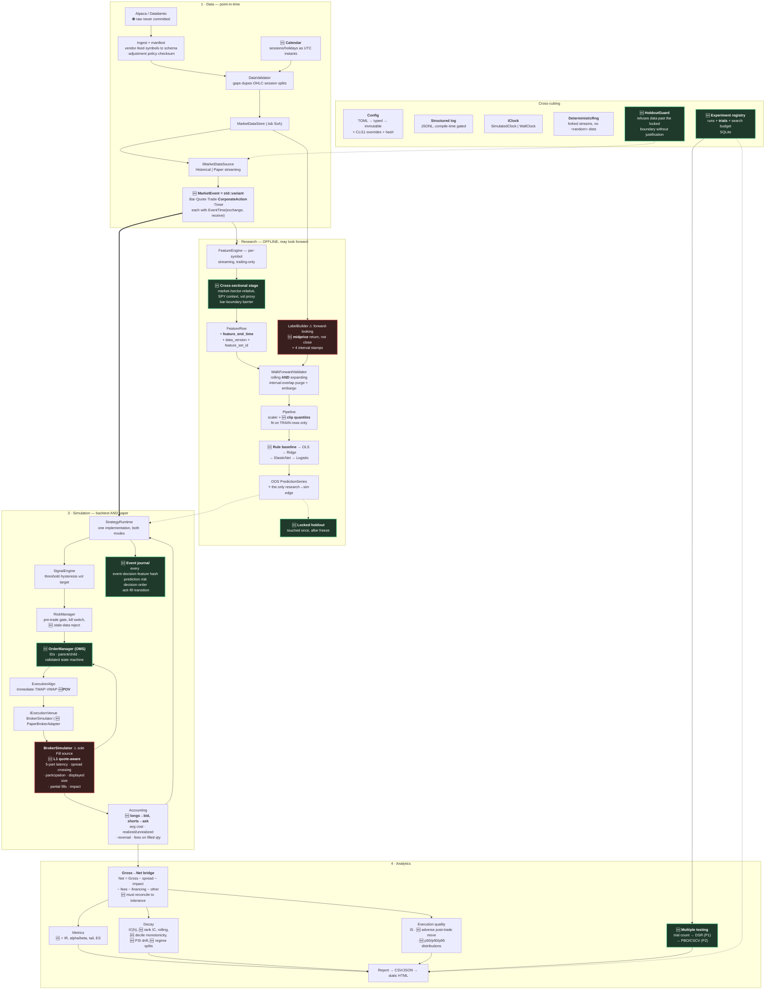
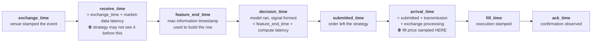

# Phase 0.5 — Research Reconciliation

**Inputs reconciled:** `docs/00-architecture.md` (Phase 0 design) × the deep-research specification.
**Status:** proposal awaiting approval. No implementation until the open decisions in §7 are closed.

This document is the audit trail for why the architecture changed. Every row states the existing
decision, what the research recommends, the verdict, and the reason. Where I am keeping an existing
decision against the research, the reason is stated explicitly rather than by omission.

---

## 1. Headline verdict

The Phase 0 architecture is **directionally correct and structurally compatible** with the research.
The two-pipeline / one-runtime design, the streaming-feature defence against lookahead, the
single-fill-source rule, and the determinism contract all match what the research asks for, and in
two places Phase 0 is stricter than the research (linker-level label isolation; a prohibition on
`<random>` distributions). Nothing needs to be thrown away.

But the research exposes **six substantive gaps** and forces **one significant reordering of the
roadmap**. In descending order of consequence:

| # | Gap | Why it matters |
|---|---|---|
| **G1** | **Only two timestamps.** Phase 0 carries `event_time` + `available_time`. The research requires seven distinct times across the lifecycle, plus four interval stamps per training observation. | This is the backbone of point-in-time correctness. Two stamps cannot express feed latency separately from decision latency, and cannot express label interval overlap for purging. Everything else in the leakage story depends on getting this right. |
| **G2** | **No final locked holdout.** Phase 0 has development + walk-forward OOS. | Walk-forward alone does not control for the researcher iterating on the walk-forward result. Without a chronologically last, mechanically protected period, the honest answer to "what did you never look at?" is "nothing." |
| **G3** | **No trial registry / multiple-testing control.** Phase 0 has a *run* registry (config → metrics). | A run registry answers "what produced this?" It does not answer "how many things did you try before this one looked good?" DSR and PBO both need the trial count. |
| **G4** | **Bar-based simulator as the target.** Phase 0 designs an OHLCV simulator with a synthesised spread. | The research is unambiguous that the portfolio-quality standard is **L1 quote-aware**. Synthesising a spread from high/low is a proxy for the one number the execution study is actually about. |
| **G5** | **Single mark-to-market price.** `Portfolio::mark(sym, price, ts)`. | Longs must mark to bid and shorts to ask for liquidation value, with mid-mark reported separately. A mid-marked equity curve overstates NAV by half a spread per unit of gross exposure, every single bar. |
| **G6** | **No cross-instrument feature stage.** Phase 0's `FeatureSet` is strictly per-symbol and streaming. | Market-relative and sector-relative returns need SPY's state at the same timestamp. There is no place in the current engine for a feature that depends on another instrument. |

**The reordering:** the research's implementation order puts **portfolio accounting and a
correctness-first execution engine at Phase 1**, before any features or models. Phase 0 had
execution at Phase 7, after the modelling stack. The research ordering is better and I recommend
adopting it. Accounting invariants and the gross-to-net bridge are the hardest correctness surface
in the system, they can be fully tested against a synthetic random-signal strategy with no model at
all, and every downstream number is meaningless until they hold. Building models first means
discovering accounting bugs after you have already formed beliefs about a strategy.

---

## 2. Reconciliation table

Verdicts: **KEEP** (Phase 0 stands) · **MODIFY** (Phase 0 changes) · **ADD** (new) · **DEFER**
(accepted but scheduled later) · **REJECT** (declining the recommendation, with reason).

### 2.1 Data and point-in-time semantics

| # | Existing Phase 0 decision | Research recommendation | Verdict | Reason |
|---|---|---|---|---|
| D1 | `event_time` + `available_time` on every record | Seven lifecycle times: exchange, receive, feature-cutoff, decision, order-submission, arrival, fill | **MODIFY** | See G1. Introduce an `EventTime{exchange_time, receive_time}` on market events, `feature_end_time` on feature rows, and explicit `decision_time`/`submitted_time`/`arrival_time`/`fill_time` on the order path. `available_time` becomes a derived view of `receive_time`, not a substitute for the chain. |
| D2 | Labels carry `asof` + `realised_at` | Four stamps: `sample_start_time`, `feature_end_time`, `label_start_time`, `label_end_time` | **MODIFY** | Purging needs the label *interval*, not just its end. With overlapping labels (h > step) two stamps cannot express the overlap test correctly. |
| D3 | US equities, daily bars, 100–300 names, cross-sectional | Liquid ETF universe (SPY QQQ IWM DIA XLF XLK XLE TLT GLD), 1-minute bars, then L1 quotes | **MODIFY** | **See §6, Conflict A — this is the one decision that reverses an answer you already gave.** Recommend adopting the research. It removes survivorship bias, nearly removes corporate actions, and makes TWAP/VWAP/POV meaningful from day one instead of requiring a bolted-on second dataset. |
| D4 | Cross-sectional ranking and per-name attribution | Per-instrument or pooled conditional expected return; rank models a "strong later extension" | **MODIFY** | Nine ETFs is too thin a cross-section for rank-based construction. Primary formulation becomes a **pooled panel regression** with market-relative features; cross-sectional ranking demoted to P2, revisited only if the universe widens. |
| D5 | `data/raw` immutable + SHA256 | Never commit or redistribute vendor raw data; publish loaders, manifests, checksums, synthetic fixtures, derived aggregates | **ADD** | Phase 0 said "immutable + checksummed" but never said "and gitignored." Add an explicit data-licensing policy doc and a CI check that fails if anything under `data/raw` is staged. |
| D6 | Custom `.tsb` columnar binary | Parquet (optional, later); simple local format first | **KEEP** + **DEFER** Parquet | `.tsb` avoids a heavy Arrow dependency and is a legitimate systems-engineering artefact. Keep the `ptl::io` boundary thin enough that a Parquet backend is a drop-in. Parquet → P2. |
| D7 | UTC nanoseconds throughout, no `std::chrono` tzdb, session calendar as UTC instants | Store raw timestamps in UTC nanoseconds; convert calendar display separately | **KEEP** | Exact match, and Phase 0's rationale (libc++ lacks tzdb) is an additional independent reason. |
| D8 | No corporate-action event type | `CorporateAction` in the canonical event taxonomy | **ADD** | Even the ETF universe pays dividends (SPY, TLT, XLF). Add the event type in Phase 2; dividend cash credit and split adjustment are P1 correctness, tested by the synthetic-split invariant test. |
| D9 | Data source unspecified | Alpaca minute bars/quotes prototype → Databento upgrade; free tier is IEX-only | **ADD** | The IEX/SIP distinction must be stated in the README. IEX is a small share of consolidated volume, so a spread measured on IEX is not the NBBO spread. This is a headline honesty item, not a footnote. |

### 2.2 Features

| # | Existing | Research | Verdict | Reason |
|---|---|---|---|---|
| F1 | Streaming `IFeature` with `update`/`value` only, no series access | Trailing-only features, `feature_end_time <= decision_time` | **KEEP** | Phase 0's mechanism is stronger than what the research asks for: an interface with no random access cannot peek, so this is enforced by type rather than by review. Add `feature_end_time` to the emitted row to satisfy the lineage requirement. |
| F2 | Per-symbol `FeatureSet` only | Market-relative return, sector-relative return, SPY context, broad-market vol proxy | **ADD** | See G6. Introduce a two-stage feature pipeline: per-symbol streaming stage, then a **cross-sectional barrier** at each bar boundary where instrument-spanning features are computed from the already-updated per-symbol states. The barrier is itself a point-in-time guarantee: it may only read states whose `feature_end_time` equals the current bar close. |
| F3 | `VolumeZScore` over a trailing window | Relative volume vs **minute-of-day** historical median | **MODIFY** | Correctness issue, not a preference. Intraday volume has a strong U-shape; a plain trailing z-score conflates time-of-day with genuine volume surprise, and the feature would mostly encode "it is near the open." Needs a rolling per-minute-of-day baseline. |
| F4 | Daily-horizon lags (1/5/20 day) | 1/5/15/30/60/390-minute lagged log returns | **MODIFY** | Follows from the frequency change (D3). |
| F5 | RSI, ATR | Not mentioned | **DEFER** | Keep the estimators (cheap, already specified) but drop them from the initial feature set. The research's list is deliberately unglamorous and defensible; RSI in particular has weak empirical grounding and would be hard to justify in an interview. |
| F6 | No intraday seasonality | Minute-of-day sine/cosine or bucket controls | **ADD** | Necessary once the frequency is intraday, otherwise the model learns time-of-day effects through the wrong features. |
| F7 | No spread feature | Quoted spread in bps `(ask-bid)/mid × 1e4` | **ADD** | P1, gated on L1 quote availability. Serves double duty as a feature and as the cost-model input. |
| F8 | No order-flow features | Signed trade imbalance, quote imbalance, OFI — venue- and horizon-dependent | **DEFER** (P2) | Requires reliable quote/trade data and correct trade signing. Research explicitly scopes this as conditional. |

### 2.3 Labels and modelling

| # | Existing | Research | Verdict | Reason |
|---|---|---|---|---|
| M1 | Label = `log(close[t+1]/close[t]) / σ_trailing` | Label = `log(mid[t+h]/mid[t])`; **do not use the future close as both label and execution price** | **MODIFY** | The close-based label is a real error: it silently couples the prediction target to the price the simulator might fill at. Switch to **midprice** returns. This is the cleanest statement of the "label price ≠ execution price" separation. |
| M2 | Volatility normalisation as the default target | Plain log midprice return primary; cost-aware variant offered | **KEEP as configurable, MODIFY default reporting** | Partial disagreement, stated openly. Pooling nine ETFs with volatilities spanning roughly 3× (TLT vs XLE) means an un-normalised pooled regression is dominated by the high-vol names — the same scale-heterogeneity argument the research uses to recommend rank models. Resolution: implement both, default to the research's plain formulation for per-instrument fits, use vol-normalisation for the pooled panel fit, and **report both** as a robustness pair rather than picking one. |
| M3 | Regression primary, logistic as cross-check | Return regression primary, direction classification secondary diagnostic | **KEEP** | Exact agreement. |
| M4 | OLS → Ridge → Logistic → (later trees/GBM) | Rule baseline → OLS → Ridge → ElasticNet → Logistic → shallow tree → RF → GBM → online | **MODIFY** | Phase 0 skipped the **cost-aware rule baseline**, which is the single most useful entry in that list: if the ridge model does not beat a volatility-targeted momentum/reversal rule after costs, the ML adds nothing and that is the finding. Add it as step 0 and make it a permanent benchmark, not a throwaway. ElasticNet added at P2. |
| M5 | `StandardScaler` fit on train rows only | Train-only normalisation **and** train-only winsorisation/clipping quantiles, stored with the model artifact | **MODIFY** | Phase 0 covered the scaler but not the clipping thresholds — fitting winsorisation quantiles on the full sample is the same leak wearing a different hat. Both go inside `Pipeline`, both serialise with the artifact. |
| M6 | Per-fold refit | Fixed retraining cadence (monthly), prediction always from the most recent model trained entirely before the prediction timestamp | **MODIFY** | Phase 0 implied refit-per-fold, which is coarser than a stated cadence. Make cadence an explicit config field so "when was this model trained relative to this prediction?" has a one-line answer. |
| M7 | Diagnostics: β, se, R², IC, condition number | + variance-inflation factors, feature correlation, regularisation path | **ADD** | Cheap to compute, and VIF is exactly the diagnostic that justifies choosing ridge over OLS. Good interview material. |

### 2.4 Validation

| # | Existing | Research | Verdict | Reason |
|---|---|---|---|---|
| V1 | Development + walk-forward OOS | **Three levels:** development / walk-forward OOS / final locked holdout | **ADD** | See G2. Proposal: a `HoldoutGuard` that owns the holdout date boundary. Any feed, store, or validator asked for data past that boundary returns an error unless the run was launched with `--unlock-holdout --justification="..."`, which writes an indelible row to the trial registry. Mechanical, auditable, and a strong thing to be able to point at. |
| V2 | Purge by `realised_at`, embargo in bars | Purge any train observation whose **label interval overlaps** the test interval; embargo predeclared from horizon + autocorrelation | **MODIFY** | Interval overlap, not endpoint comparison — see D2. Also: the embargo length must be *declared before* looking at results, and recorded in the config hash. |
| V3 | Rolling **or** expanding, config-selected | Report **both** as a robustness comparison; do not pick on Sharpe | **MODIFY** | Turning a config option into a mandatory reported pair. Choosing the window mode by which one backtests better is itself a form of selection bias. |
| V4 | 3y train / 1y test / 1y step | 12–24mo warmup, 12–24mo train, 1–3mo validate, 1mo test, 1mo step, monthly retrain, last 3–6mo locked | **MODIFY** | Follows from the frequency change. Note the research adds a **validation** window distinct from test — Phase 0 had only train/test, with no clean place to select hyperparameters without touching test. |
| V5 | Run registry (config, git SHA, seed, metrics) | **Trial** registry: every hyperparameter/feature/model trial logged; fixed search budget declared up front | **ADD** | See G3. Extend the SQLite schema from runs to `trials`, with a `search_budget` declared per research question. |
| V6 | None | Deflated Sharpe Ratio; PBO via CSCV | **ADD** (DSR P1, PBO P2) | DSR needs only the trial count and return moments — cheap once the trial registry exists. CSCV is a heavier construction; defer but keep in the roadmap. |
| V7 | Shuffle-invariance negative test | Not mentioned | **KEEP** | Phase 0 extra. Deliberately shuffling the time index and showing Sharpe explodes proves the pipeline is sensitive to the thing that should break it. Worth keeping. |

### 2.5 Execution simulation

| # | Existing | Research | Verdict | Reason |
|---|---|---|---|---|
| X1 | Bar-based simulator, synthesised spread (Corwin–Schultz / fixed bps) | Fidelity ladder: bar → **L1 quote-aware (core standard)** → trade+quote → L2 → L3 | **MODIFY** | See G4. Bar mode remains as the Phase-3 correctness scaffold and as a documented degraded fallback; **L1 quote-aware becomes the target for the portfolio-quality version.** The `ICostModel`/matching interfaces must be designed quote-first so this is not a rewrite. |
| X2 | Latency: decision→wire, wire→exchange, ack | Five components: market-data, strategy compute, order transmission, exchange processing, acknowledgment | **MODIFY** | Phase 0 missed **market-data latency**, which is a different animal: it shifts when the strategy is even permitted to *see* a quote, and therefore feeds back into `receive_time` and the feature cutoff. The others only delay the order. |
| X3 | Impact `η·σ_daily·√(Q/ADV)`, η=0.4 | `c·(Q/ADV)^α` or intraday `c·σ_intraday·(Q/V_interval)^α`; sensitivity at 0.5×/1×/2×/3× | **MODIFY** | Adopt the intraday form (correct for minute data) and make the exponent α configurable rather than hard-coded at 0.5. Adopt the standard cost-multiplier sweep. Lower η to the research's 0.10 as the default starting point and let the sensitivity sweep speak. |
| X4 | Participation cap 10% of bar volume | `max_participation_rate = 0.05`; for L1, constrain by displayed top-of-book size plus conservative replenishment | **MODIFY** | Take the more conservative 5%. Add the L1 displayed-size constraint as a second, tighter binding constraint once quotes exist. |
| X5 | Limit fill if `bar.low < limit` with a haircut | Never fill merely because a bar's high/low touched the price without a stated intrabar path assumption; label as probabilistic/conservative, not queue reconstruction | **MODIFY** | Phase 0 already flagged this as the weakest part but still specified the touch rule. Restate as an explicit, named `ConservativeTouchFillModel` with its assumption printed in the run manifest, and add the **no-fill test** (nonmarketable limit must not fill absent a modelled crossing). |
| X6 | Queue position: not modelled, noted as a limitation | Never claim queue realism from bars or L1; any queue model states its assumptions | **KEEP** | Agreement. Strengthen to an explicit README statement and an assertion that no code path reports a "queue position" field. |
| X7 | No order state machine / OMS | Explicit validated order state transitions; `OrderManager` owns IDs, lifecycle, parent-child | **ADD** | Phase 0 had an `OrderState` enum but no owner and no transition validation. Add a `ptl::oms` module between risk and execution. Illegal transitions become errors, which is what makes partial-fill and cancel accounting testable. |
| X8 | Mid or last-price marking | Longs → bid, shorts → ask for liquidation value; mid-mark reported separately | **MODIFY** | See G5. Two marking modes, liquidation as the reported default, mid as an analytic overlay. |

### 2.6 Execution algorithms

| # | Existing | Research | Verdict | Reason |
|---|---|---|---|---|
| A1 | Immediate, TWAP, VWAP core; POV "later" | Immediate, TWAP, VWAP, **POV** all core | **MODIFY** | POV promoted to P1. It is also the most interesting of the four to discuss, because its completion time is uncertain — which is precisely the trade-off the other three hide. |
| A2 | Hold instrument/side/qty/decision-time/arrival/horizon/replay/latency/costs/impact/participation/seed constant | Same list | **KEEP** | Exact match. Phase 0 got this right. |
| A3 | IS, avg price, slippage, costs, fill rate, duration | + VWAP slippage, participation rate achieved, spread paid, modelled impact, residual opportunity cost, **adverse post-trade move** at fixed horizons, and **distributional** reporting (median, p90/p95, tail) | **ADD** | Two real gaps: adverse post-trade midprice move is the adverse-selection diagnostic and is the metric that distinguishes a good algo from a lucky one; and mean-only reporting hides the tail that actually matters for execution. |
| A4 | Implementation-shortfall optimiser | Listed as an advanced extension | **DEFER** (P3) | Agreement. |

### 2.7 Portfolio accounting

| # | Existing | Research | Verdict | Reason |
|---|---|---|---|---|
| P1 | `Position{qty, avg_cost, realised_pnl, ...}`, FIFO mentioned | Average cost or FIFO — pick, document, test | **MODIFY** | Phase 0 said "avg cost (FIFO)" ambiguously. **Decide: weighted average cost as the P0 implementation**, behind a `ILotAccounting` interface, with FIFO at P2. Simpler to get right, and the interface keeps the door open. Needs an explicit decision from you (§7). |
| P2 | Cash conservation + P&L identity tests | + position reversal resets average cost, short-sale cash handling, fees on **filled** not requested qty, no double-counted fees | **ADD** | The research's bug list is a ready-made test list. Position reversal (long → short through zero) is the classic one and Phase 0 did not name it. |
| P3 | `PnLAttribution` with by-asset / by-feature / by-fold + IS breakdown | Reconciliation identity: `Net = Gross − spread − impact/slippage − fees − financing/borrow − other`, summing to net within a documented tolerance | **MODIFY** | Phase 0 had attribution but not an enforced **reconciliation**. Make it a test: attribution components must sum to reported net P&L within a stated tolerance, or the run fails. |
| P4 | No borrow/financing | Borrow rate and availability if shorting enabled | **ADD** (P1 if shorting on) | Depends on the shorting decision in §7. If the book is market-neutral this is material, not decorative. |
| P5 | No settlement/margin | Settled vs unsettled cash, margin policy if applicable | **DEFER** (P3) | Not needed for a research simulator; note as a limitation. |

### 2.8 Architecture and engineering

| # | Existing | Research | Verdict | Reason |
|---|---|---|---|---|
| E1 | Two pipelines, one `Engine`; backtest and paper differ by clock + feed | `HistoricalSource + SimulatedClock + BrokerSimulator` vs `PaperSource + WallClock + PaperBrokerAdapter`, same `StrategyRuntime` | **KEEP** | Exact match, independently arrived at. This is the project's spine and both documents agree on it. |
| E2 | Tagged POD `MarketEvent` with a union, fixed 64 B | Prefer `std::variant` + `std::visit` for the central event representation | **MODIFY — conceding** | See §6, Conflict B. My justification was cache locality, which is premature optimisation by my own Phase 0 rules. At ~9 instruments × 390 min × 252 days the event count is a few million per year — nowhere near a bottleneck. The union also carries a real UB hazard with non-trivial members. **Adopt `std::variant` now; benchmark a POD alternative in the profiling phase and switch only with evidence.** |
| E3 | `ptl::labels` unlinked from live binaries | Feature/label separation | **KEEP** | Stronger than the research asks. A leak through labels is a linker error. |
| E4 | `BrokerSimulator` sole `Fill` constructor | `BrokerSimulator` must not make strategy decisions; `OrderManager` must not invent fills | **KEEP** | Agreement; Phase 0's private-constructor enforcement is the mechanism. |
| E5 | Single-threaded implied | Deterministic single-threaded core first; concurrency only when justified | **ADD as explicit principle** | Promote from implication to a stated, documented rule so it is not quietly violated later. |
| E6 | `DeterministicRng`, no `<random>` distributions, forked streams | Deterministic simulation, same seed → byte-identical output | **KEEP** | Stronger than the research asks. The `<random>` distribution prohibition is the specific reason results reproduce across macOS and Linux CI. |
| E7 | Hand-rolled `--set` override parsing | CLI11 | **MODIFY** | Accept. Small, focused, and removes code I would otherwise have to test. |
| E8 | Eigen, Catch2, toml++, spdlog, SQLite, Google Benchmark | Same + CLI11 | **MODIFY** | Add CLI11. Everything else matches. |
| E9 | Module tree with `include/ptl/{core,market,features,labels,models,validation,signals,risk,execution,portfolio,engine,analytics,io}` | `core/ data/ research/ trading/ apps/` grouping with `oms/`, `venue_sim/`, `accounting/`, `experiments/`, `calendar/`, `replay/` | **MODIFY** | Adopt the missing modules (`oms`, `calendar`, `experiments`), keep the flat `ptl::` namespace tree rather than nesting under `research/` and `trading/` — flat keeps include paths short and the dependency graph is enforced by CMake targets regardless of directory grouping. |
| E10 | Benchmarks report events/sec, ns/event, memory, zero allocations | + **p50/p99/max latency**, allocation counts, dataset size, compiler, flags, CPU architecture | **ADD** | Mean-only benchmark reporting is the performance equivalent of Sharpe-only performance reporting. Percentiles go in the README table. |
| E11 | ASan/UBSan presets, CI on 2 compilers | asan-ubsan, tsan, coverage, benchmark presets; macOS + Linux | **MODIFY** | Add coverage and benchmark presets; TSan deferred until threads exist (there are none). |
| E12 | Feature-matrix and OOS-prediction caching as the primary optimisation | Profile first, optimise measured bottlenecks | **KEEP** | Compatible: the caching win is algorithmic (avoiding redundant work), not micro-optimisation, and it is justified by an operation count rather than a profile. |

### 2.9 Analytics, decay, reporting

| # | Existing | Research | Verdict | Reason |
|---|---|---|---|---|
| R1 | IC by horizon, ICIR, rolling IC/Sharpe/hit-rate, β stability, breakeven cost | + **rank IC**, decile monotonicity after costs, forward-return curve by prediction decile, prediction-distribution drift, feature-distribution drift (PSI) | **ADD** | Rank IC is the more robust statistic under heavy tails and Phase 0 only had Pearson IC. Decile monotonicity is the single most legible chart in the whole project. |
| R2 | Metrics list (Sharpe, Sortino, Calmar, MaxDD, hit rate, turnover, profit factor) | + Information Ratio, alpha/beta decomposition, tail metrics (expected shortfall, skew, worst days) | **ADD** | Alpha/beta matters especially here: with nine correlated ETFs, showing the strategy is not just levered SPY beta is essential. |
| R3 | No regime analysis | Performance by volatility / spread / volume regime; trend vs range | **ADD** (P1) | The research calls signal decay a major differentiator and regime conditioning is half of it. Also the mechanism for distinguishing genuine decay from a regime shift. |
| R4 | No drift/decay distinction | Distinguish decay from data drift, schema change, universe change | **ADD** | A diagnostic decision procedure, documented, not just a chart. |
| R5 | Static HTML dashboard from C++; Python optional for exploration | Python only as an optional external visualisation layer; core semantics in C++ | **KEEP** | Exact agreement. |

---

## 3. What Phase 0 already had right

Worth recording, so these do not get relitigated:

1. **Two pipelines, one runtime, differing only in clock and adapters** — independently matches the research's central parity rule.
2. **Streaming-only feature interface** — a stronger lookahead defence than "trailing-only by convention."
3. **`ptl::labels` isolated at link time** — the research does not go this far.
4. **Single `Fill` construction site** — matches the "BrokerSimulator must not make strategy decisions / OrderManager must not invent fills" separation.
5. **`DeterministicRng` with the `<random>` distribution prohibition** — the specific mechanism that makes cross-platform reproducibility real rather than aspirational.
6. **UTC-nanosecond time with no tzdb dependency** — matches, with an additional toolchain justification.
7. **Purge and embargo** — present from the start.
8. **Dense `SymbolId`** — removes hash-iteration-order as a determinism hazard.
9. **Feature-matrix / OOS-prediction caching** — the algorithmic performance decision, correctly identified as architectural.
10. **No C++ GUI** — matches.
11. **Shuffle-invariance negative test** — a Phase 0 extra worth keeping.
12. **Honest framing ("high-throughput research simulator, not low latency")** — matches the research's repeated warning.

---

## 4. Updated architecture diagram

Changes from the Phase 0 diagram are marked. This supersedes §2 of `00-architecture.md`, which
will be regenerated once the §7 decisions are closed.

### 4.1 Timestamp chain (the G1 fix)

Invariant, asserted in debug and counted in release:
`exchange_time ≤ receive_time ≤ feature_end_time ≤ decision_time ≤ submitted_time ≤ arrival_time ≤ fill_time`.
A single monotonicity check over this chain catches most leak classes, including same-bar execution
as a special case (`arrival_time > decision_time` strictly).

---

## 5. Research Requirements Matrix

**Priorities:** P0 = must-have correctness · P1 = core portfolio feature · P2 = advanced enhancement
· P3 = optional research extension.

**Phases** refer to the reconciled roadmap in §8.

| Requirement | Pri | Phase | Component | Verification |
|---|---|---|---|---|
| **DATA & POINT-IN-TIME** |
| Seven-stage timestamp chain, monotonic | P0 | 1–3 | `core::types`, `market::EventTime` | `test_timestamp_chain` asserts monotonicity on every order lifecycle |
| `EventTime{exchange, receive}` on all market events | P0 | 2 | `market::events` | Compile-time: no event constructible without both |
| Event processed only when `exchange_time ≤ sim_clock` | P0 | 2 | `engine::Engine`, `SimClock` | `SimClock::advance_to` throws on backward move; `test_event_ordering` |
| Label 4-interval stamps | P0 | 5 | `labels::Labels` | `test_purge_interval_overlap` |
| UTC nanoseconds, no tzdb | P0 | 1 | `core::types` | `test_timestamp_parse` round-trip; builds on macOS + Linux |
| Session calendar as precomputed UTC instants | P0 | 2 | `market::Calendar` | `test_session_boundaries` incl. half-days, DST transition dates |
| Chronological ordering, no duplicates, OHLC invariants | P0 | 2 | `market::DataValidator` | `test_validator` with 8 injected defect classes |
| Data manifest: vendor, feed, symbols, tz, schema, adjustment policy, checksum | P0 | 2 | `io::Manifest` | Manifest hash enters RunId; `test_manifest_stability` |
| Raw vendor data never committed | P0 | 1 | `.gitignore`, CI | CI job fails if `data/raw/**` is staged |
| Publish loaders, manifests, hashes, synthetic fixtures only | P0 | 1 | repo policy + `docs/data-policy.md` | Manual review + CI check above |
| IEX-vs-SIP coverage stated | P0 | 2 | README, manifest | Manifest records feed; README states it |
| Liquid ETF universe, 1-min bars | P1 | 2 | `config/universe.toml` | Ingest smoke test over the 9 tickers |
| L1 quotes ingested and normalised | P1 | 8 | `market::Quote` | `test_quote_normalisation` |
| `CorporateAction` event, dividend cash credit, split adjustment | P1 | 2–3 | `market::events`, `portfolio` | `test_synthetic_split` — shares/cost basis/equity economically invariant |
| Point-in-time instrument master | P2 | 2 | `market::Instrument` | Deferred; ETFs make this low-risk initially |
| Parquet normalized store | P2 | — | `io` | Deferred; `.tsb` first |
| **FEATURES** |
| Trailing-only, no future access by construction | P0 | 4 | `features::IFeature` | `test_feature_causality`: identical prefix ⇒ bit-identical values |
| `feature_end_time` + `data_version` + `feature_set_id` on every row | P0 | 4 | `features::FeatureRow` | `test_feature_lineage` |
| Warmup honesty (`ready()` gating) | P0 | 4 | `features::FeatureSet` | `test_warmup` — no value consumed while `!ready()` |
| Lagged log returns 1/5/15/30/60/390 min | P1 | 4 | `features::momentum` | Hand-computed fixture |
| Short-term reversal (−r₁, −r₅) | P1 | 4 | `features::reversion` | Fixture |
| Trailing return z-scores (Welford) | P1 | 4 | `features::RollingStdev` | Numerical-stability test vs naive sum-of-squares |
| MA deviation 30/60/390 | P1 | 4 | `features::reversion` | Fixture |
| Realized vol 15/60/390 | P1 | 4 | `features::volatility` | Fixture |
| Relative volume vs **minute-of-day** baseline | P1 | 4 | `features::liquidity` | `test_minute_of_day_baseline` — flat under a pure U-shape input |
| Quoted spread in bps | P1 | 8 | `features::liquidity` | Fixture from L1 quotes |
| Intraday seasonal controls (sin/cos minute-of-day) | P1 | 4 | `features::seasonal` | Fixture |
| Market-relative + sector-relative returns, SPY context | P1 | 4 | `features::CrossSectionalStage` | `test_cross_sectional_barrier` — reads only same-bar states |
| Quote imbalance | P2 | 8 | `features::microstructure` | Gated on reliable L1 |
| Order flow / OFI / signed trade imbalance | P2 | 16 | `features::orderflow` | Requires trade signing; deferred |
| **LABELS & MODELS** |
| Label on **midprice**, never the close used for fills | P0 | 5 | `labels::LabelBuilder` | `test_label_price_independence` — label unchanged when fill model changes |
| Label horizon declared up front, in config hash | P0 | 5 | `config` | Config hash test |
| Train-only scaler fit | P0 | 6 | `models::Pipeline` | `test_scaler_containment` — mutate test rows, scaler params unchanged |
| Train-only winsorisation/clip quantiles | P0 | 6 | `models::Pipeline` | Same test, extended to clip thresholds |
| Preprocessing params serialised with model artifact | P0 | 6 | `models::IModel::save` | Round-trip test: reload ⇒ identical predictions |
| Cost-aware rule baseline | P1 | 6 | `models::RuleBaseline` | Permanent benchmark row in every report |
| OLS with diagnostics | P1 | 6 | `models::Ols` | β matches Eigen and an R fixture to 1e-10 |
| Ridge (primary) | P1 | 6 | `models::Ridge` | λ→0 recovers OLS |
| Logistic (secondary diagnostic) | P1 | 6 | `models::Logistic` | Calibration + AUC on fixture |
| ElasticNet / Lasso | P2 | 16 | `models::ElasticNet` | Deferred |
| Shallow tree / RF | P2 | 16 | `models::tree` | Deferred |
| Gradient boosting | P3 | 16 | — | Only after linear baselines succeed |
| Online / RLS / EWMA-ridge | P3 | 16 | — | Only after retraining + drift monitoring exist |
| VIF + feature correlation diagnostics | P1 | 6 | `models::Diagnostics` | Fixture with known collinearity |
| Fixed retraining cadence, model trained entirely before prediction | P0 | 5 | `validation::Runner` | `test_model_precedes_prediction` |
| Fixed hyperparameter grid declared before evaluation | P0 | 5 | `experiments::TrialRegistry` | Search budget recorded; overrun flagged |
| **VALIDATION** |
| No random shuffling, ever | P0 | 5 | `validation` | Shuffle-invariance negative test |
| Interval-overlap purging | P0 | 5 | `validation::WalkForwardValidator` | `test_purge_interval_overlap` |
| Embargo, length predeclared | P0 | 5 | same | `test_embargo`; length in config hash |
| Rolling **and** expanding, both reported | P1 | 5 | same | Report contains both; CI checks both present |
| Development / walk-forward / **locked holdout** | P0 | 5 | `validation::HoldoutGuard` | `test_holdout_guard` — data access past boundary errors without unlock |
| Validation window distinct from test | P0 | 5 | `validation::Fold` | Fold disjointness test extended to 3 sets |
| Trial registry, every trial logged | P0 | 1, 5 | `experiments::TrialRegistry` (SQLite) | `test_trial_logging`; trial count appears in every report |
| Deflated Sharpe Ratio | P1 | 11 | `analytics::Dsr` | Fixture vs published worked example |
| PBO / CSCV | P2 | 16 | `analytics::Pbo` | Deferred |
| One-bar-lag test | P0 | 5 | `tests/leakage` | Shift all features +1 bar; performance must not improve |
| Future-perturbation test | P0 | 5 | `tests/leakage` | Alter prices after date D; predictions before D bit-identical |
| **EXECUTION SIMULATION** |
| No same-bar execution | P0 | 3 | `engine`, `oms` | `test_no_same_bar_fill` — no `fill_time ≤ decision_time` |
| Bar-based simulator (scaffold) | P0 | 3 | `execution::BrokerSimulator` | Accounting invariant suite |
| **L1 quote-aware simulator (core standard)** | P1 | 8 | same | `test_quote_aware_fill` — buy at ask, sell at bid, post-latency |
| Five-component latency model | P1 | 8 | `execution::ILatencyModel` | `test_latency_decomposition`; 10× latency sensitivity run |
| Spread crossing on marketable orders | P0 | 8 | `execution` | Fill price never better than the touch |
| Commissions per-share with minimum | P0 | 3 | `execution::ICostModel` | `test_commission`; fees on **filled** qty only |
| Taker fee / maker rebate | P1 | 8 | same | Fixture |
| Stochastic slippage, seeded | P0 | 3 | same | Determinism test |
| Impact `c·σ_intraday·(Q/V)^α`, α configurable | P1 | 8 | same | Sensitivity at 0.5×/1×/2×/3× cost |
| Cost monotonicity | P0 | 3 | `execution` | `test_cost_monotonicity` — higher costs cannot improve net P&L |
| Participation cap 5% | P0 | 3 | `execution` | `test_participation_cap` |
| Displayed-size constraint + conservative replenishment | P1 | 8 | `execution` | `test_fill_constraint` — filled ≤ modelled liquidity |
| Partial fills | P0 | 3 | `oms`, `execution` | `test_partial_fill` accounting |
| Unfilled residual policy (hold / cancel / escalate) | P1 | 9 | `execution::IExecutionAlgo` | Per-algo policy test |
| Nonmarketable limit does not fill | P0 | 8 | `execution` | `test_no_fill` |
| Conservative touch-fill model, assumption printed | P1 | 3 | `execution::ConservativeTouchFillModel` | Assumption string appears in run manifest |
| No queue-position claim anywhere | P0 | all | repo-wide | CI grep: no `queue_position` field; README statement |
| Validated order state machine | P0 | 3 | `oms::OrderManager` | `test_order_state_machine` — illegal transitions error |
| L2 market-by-price replay | P3 | 16 | `execution::l2` | Separate module, separately documented |
| L3 order-level replay | P3 | — | — | Out of scope; stated as a limitation |
| **EXECUTION ALGORITHMS** |
| Immediate | P1 | 9 | `execution::ImmediateAlgo` | Parent-order harness |
| TWAP | P1 | 9 | `execution::TwapAlgo` | Equal-slice test |
| VWAP | P1 | 9 | `execution::VwapAlgo` | Profile-proportional test |
| **POV** | P1 | 9 | `execution::PovAlgo` | Realised-participation test; completion-time distribution |
| Implementation-shortfall optimiser | P3 | 16 | — | Deferred |
| Fair comparison: 11 held-constant factors | P0 | 9 | `analytics::ExecutionComparator` | Harness asserts each factor identical across arms |
| IS in currency and bps, sign-correct for both sides | P0 | 9 | same | `test_is_sign_convention` for buy and sell |
| Arrival slippage, VWAP slippage, fill rate, completion time, participation achieved, spread paid, modelled impact, fees, residual opportunity cost | P1 | 9 | same | Report table |
| Adverse post-trade midprice move at fixed horizons | P1 | 9 | same | Report column |
| Distributional reporting (median, p90, p95, tail) | P1 | 9 | same | Report shows distribution, not mean only |
| **ACCOUNTING** |
| `Equity = Cash + Σ qty·mark` | P0 | 3 | `portfolio::Portfolio` | Invariant asserted every event |
| Signed-quantity conservation across fills | P0 | 3 | same | `test_quantity_conservation` |
| Longs mark to bid, shorts to ask | P0 | 8 | `portfolio` | `test_liquidation_marking` |
| Mid-mark reported separately | P1 | 8 | `analytics` | Both curves in report |
| Weighted-average cost (FIFO behind interface) | P0 | 3 | `portfolio::ILotAccounting` | `test_avg_cost`; FIFO at P2 |
| Position reversal resets cost basis | P0 | 3 | same | `test_position_reversal` long→short through zero |
| Short-sale cash handling | P0 | 3 | same | `test_short_cash` |
| Fees on filled qty, never double-counted | P0 | 3 | same | `test_fee_accounting` |
| Realized from matched cost basis, not current mark | P0 | 3 | same | `test_realized_pnl` |
| Borrow / financing cost | P1 | 8 | `portfolio::IFinancingModel` | Conditional on shorting decision |
| Settlement / margin | P3 | — | — | Documented limitation |
| **ANALYTICS** |
| Gross→Net bridge reconciles to tolerance | P0 | 11 | `analytics::PnLAttribution` | `test_attribution_reconciles` — components sum to net within tolerance |
| Attribution by signal / model / instrument / time / regime / execution / lifecycle / exposure | P1 | 11 | same | Each view sums to the same net |
| CAGR, vol, net Sharpe, Sortino, MaxDD, Calmar, hit rate, profit factor, turnover | P1 | 11 | `analytics::Metrics` | Hand-computed fixture |
| Information Ratio, alpha/beta vs SPY | P1 | 11 | same | Fixture |
| Tail metrics: expected shortfall, skew, worst days | P1 | 11 | same | Fixture |
| Break-even transaction cost | P1 | 11 | same | Sweep until Sharpe = 0 |
| Gross-to-net degradation | P1 | 11 | same | Report |
| IC and **rank IC** by horizon | P1 | 11 | `analytics::Decay` | Fixture with known correlation |
| Rolling 20/60/120 IC, Sharpe, hit rate | P1 | 11 | same | Report |
| Decile monotonicity after costs | P1 | 11 | same | Report chart |
| Prediction-distribution drift | P1 | 11 | same | Report |
| Feature-distribution drift (PSI, correlation drift, missingness) | P1 | 11 | same | Report |
| Rolling coefficients / regularisation path | P1 | 11 | same | Report |
| Regime splits: vol, spread, volume, trend/range | P1 | 11 | `analytics::Regime` | Report |
| Decay vs drift vs regime-change decision procedure | P1 | 11 | `docs/` + report | Documented procedure |
| Cost sensitivity 0.5× / 1× / 2× / 3× | P0 | 11 | `analytics` | Standard sweep in every report |
| Leave-one-instrument-out, leave-one-year-out robustness | P1 | 11 | same | Report |
| **PARITY & OPERATIONS** |
| One `StrategyRuntime`, backtest and paper | P0 | 12 | `engine` | `test_replay_parity` — replayed paper equals backtest bit-for-bit |
| `IMarketDataSource` / `IExecutionVenue` seams | P0 | 3, 12 | `engine`, `execution` | Two implementations of each compile against one runtime |
| Durable event/order journal | P1 | 12 | `engine::Journal` | Replay-from-journal test |
| Kill switch, stale-data reject, position reconciliation | P1 | 12 | `risk`, `engine` | Fault-injection tests |
| Measured and logged latency in paper mode | P1 | 12 | `engine` | Journal contains measured latencies |
| **REPRODUCIBILITY** |
| RunId = hash(config ‖ data manifest ‖ git SHA ‖ seed) | P0 | 1 | `config`, `experiments` | `test_run_id_stability` |
| Byte-identical output for identical inputs | P0 | 1, 10 | all | `test_determinism` — two runs, byte-compare |
| Deterministic single-threaded core | P0 | all | `engine` | Stated principle; no thread creation in engine |
| No `<random>` distributions | P0 | 1 | `core::rng` | Golden-value test with hard-coded expected sequence |
| Compiler, flags, CPU recorded per run | P0 | 1 | `core::version` | Present in manifest |
| **ENGINEERING** |
| C++20 baseline, C++23 only where probed | P0 | 1 | `core::compiler` | Builds on AppleClang + GCC + Clang in CI |
| CMake presets: macos-debug/release, linux-clang/gcc, asan-ubsan, coverage, benchmark | P0 | 1 | `CMakePresets.json` | CI matrix exercises each |
| ASan + UBSan in CI | P0 | 1 | CI | Job passes |
| TSan | P3 | — | — | Deferred: no threads exist |
| `-Wall -Wextra -Wpedantic -Wconversion -Werror` | P0 | 1 | `cmake/CompilerWarnings.cmake` | Build fails on warning |
| `std::variant` event stream | P1 | 2 | `market::MarketEvent` | Benchmarked vs POD in phase 13 |
| Contiguous storage, SoA for analytics, AoS for orders/fills | P1 | 2–3 | `market`, `execution` | Layout documented; benchmarked |
| Preallocation, zero steady-state allocations | P1 | 13 | `engine` | Allocation-counting test wrapper |
| Benchmarks: events/s, ns/event, **p50/p99/max**, allocations, peak RSS, dataset size, compiler, flags, CPU | P1 | 13 | `benchmarks/` | README table |
| Profile before optimising | P0 | 13 | process | ADR per optimisation, citing profile evidence |
| `std::pmr`, mmap, static polymorphism, SIMD, parallelism, SPSC queues | P2 | 13+ | — | Only with profile evidence |
| **PRESENTATION** |
| No claims of replicating any named firm | P0 | 15 | README | Manual review |
| No "institutional HFT" / "low latency" / "production-ready" claims | P0 | 15 | README | Manual review |
| Explicit assumptions doc | P0 | 3, 8 | `docs/execution-assumptions.md` | Every configurable assumption listed with default |
| Limitations section | P0 | 15 | README | Includes IEX coverage, no queue model, no L3, survivorship, impact-model calibration |
| Academic references tied to the code that uses them | P1 | 15 | `docs/methodology.md` | Each concept links to its source |
| ADRs for major decisions | P1 | 1+ | `docs/adr/` | One per reconciliation row marked MODIFY/REJECT |

---

## 6. Conflicts requiring your decision

### Conflict A — universe and frequency (**blocking, and it reverses your earlier answer**)

You chose "US equities daily + small intraday set." The research recommends **liquid ETFs, 1-minute
bars, as the primary dataset**, with L1 quotes added second.

**I recommend switching to the research's position**, for reasons that are stronger than deference:

- It **solves** the problem I flagged before Phase 1, rather than working around it. On daily bars
  TWAP, VWAP and POV are indistinguishable; my proposed fix was a second bolted-on intraday dataset,
  which means maintaining two data paths. Minute-primary makes the execution study native.
- Survivorship bias, which I listed as an unfixable limitation for free daily equity data,
  substantially **disappears** — the ETF set is stable and none of the nine are at delisting risk.
- Corporate actions shrink to dividends on a handful of names, instead of splits and symbol changes
  across 300.
- Data volume is manageable: 9 × 390 × 252 ≈ 885k bars/year, so several years fit comfortably in
  memory and the whole backtest stays fast without cleverness.

**What we lose, honestly:** the cross-section drops from ~300 names to 9, so cross-sectional ranking
and per-name attribution get much thinner, and the nine ETFs are highly correlated — effective
breadth is far below nine. The primary formulation must therefore become a **pooled panel
regression with market-relative (SPY-residualised) features**, and the honest framing is
"intraday timing signal on a small liquid universe," not "cross-sectional equity alpha."

### Conflict B — event representation (**I am conceding**)

Phase 0 specified a tagged POD `MarketEvent` with a union, justified by cache locality. The research
prefers `std::variant` + `std::visit`. **The research is right and my justification was premature
optimisation by my own stated rules.** At this event volume the difference is unmeasurable, and the
union carries a genuine UB hazard with non-trivial members. Adopt `std::variant`; revisit only if
the profiler says so.

### Conflict C — target construction (**partial disagreement, resolved by doing both**)

Phase 0 defaulted to a volatility-normalised target; the research's primary is a plain log midprice
return. Because we are pooling instruments with materially different volatilities, an un-normalised
pooled fit will be dominated by the high-vol names. Resolution: plain log midprice return as the
default for per-instrument fits, vol-normalised for the pooled fit, **both reported**. The label
switches from close-based to **midprice-based** either way, which is the more important change.

### Conflict D — storage format (**keeping Phase 0**)

`.tsb` custom columnar over Parquet. No heavy Arrow dependency, and it is a legitimate systems
artefact worth having built. `ptl::io` stays thin so Parquet is a later drop-in. Low stakes.

### Conflict E — roadmap ordering (**adopting the research**)

Phase 0 built features → models → signals → execution. The research builds **accounting and
execution first**. Adopting the research: accounting invariants are the hardest correctness surface,
they are testable with a random-signal strategy and no model, and every downstream number is
meaningless until they hold.

---

## 7. What I recommend resolving before Phase 1

Eight decisions. The first three are blocking; the rest can be defaulted if you'd rather move.

1. **Universe and frequency** — Conflict A. Minute ETFs (recommended) or stay with daily equities?
2. **Data source and entitlement** — Alpaca free (IEX only, a small share of consolidated volume, so
   spreads are not NBBO) or paid SIP? This determines whether the L1 quote-aware simulator is
   honest, and it must be stated in the README either way.
3. **Locked holdout boundary** — must be fixed **now**, before any data is examined. Recommend: last
   4 months of the ingested range. Once chosen it goes in the config hash and the guard enforces it.
4. **Label horizon `h` and rebalance cadence** — recommend h = 15 minutes, decisions at 5-minute
   intervals. These determine purge length and whether labels overlap (h > step ⇒ they do, and the
   interval-overlap purge becomes load-bearing).
5. **Lot accounting** — weighted average cost (recommended, simpler to get right) or FIFO?
6. **Shorting enabled?** — if yes, borrow cost and short-sale cash handling become P1 rather than
   deferred, and liquidation marking matters more.
7. **Event representation** — confirm `std::variant` (Conflict B).
8. **Add CLI11** — confirm.

## 8. Reconciled roadmap

Phase 0's 14 phases merged with the research's 6. Research milestones in the right column.

| Ph | Deliverable | Research milestone |
|---|---|---|
| 0 | System design | Phase 0 |
| 0.5 | This reconciliation | — |
| 1 | Repo discipline: core types, config + CLI11, logging, run **and trial** registry, CI, sanitizers, presets | Phase 0 |
| 2 | Canonical events (`std::variant`), calendar, ingest, validator, manifest, `.tsb`, feed | Phase 1 |
| 3 | **Portfolio accounting + bar-based execution + OMS** — correctness first, no model | Phase 1 |
| 4 | Feature engine: per-symbol streaming + cross-sectional stage | Phase 2 |
| 5 | Labels, walk-forward, purge/embargo, **holdout guard**, trial registry integration | Phase 2 |
| 6 | Models: rule baseline → OLS → Ridge → Logistic | Phase 3 |
| 7 | Signals, sizing, risk | Phase 3 |
| 8 | **L1 quote-aware execution simulator**, liquidation marking, financing | Phase 4 |
| 9 | Immediate / TWAP / VWAP / **POV** + parent-order harness | Phase 4 |
| 10 | End-to-end event-driven backtester | Phase 4 |
| 11 | Attribution, gross→net bridge, metrics, decay, regime, DSR | Phase 4 |
| 12 | Paper-trading parity, journal, kill switch | Phase 5 |
| 13 | Profiling, benchmarks with percentiles, allocation audit | — |
| 14 | Reporting / static HTML dashboard | — |
| 15 | Documentation, ADRs, limitations, portfolio presentation | — |
| 16+ | Optional: L2 replay, order flow, ElasticNet/trees/GBM, PBO, Parquet, FIFO lots | Phase 6 |

## 9. Impact on the Phase 1 work already started

Files written before this reconciliation, and their status:

| File | Status |
|---|---|
| `core/compiler.hpp` | **Unchanged.** Toolchain probes; the no-tzdb rationale is reinforced. |
| `core/named_type.hpp` | **Unchanged.** Matches "value types with strong domain types." |
| `core/rng.hpp/.cpp` | **Unchanged.** The `<random>` prohibition is stronger than required. |
| `core/symbol_table.hpp/.cpp` | **Unchanged.** Rename `SymbolId` → `InstrumentId` optional for vocabulary alignment. |
| `core/result.hpp/.cpp` | **Unchanged.** Matches the `std::expected`-with-fallback recommendation. |
| `core/clock.hpp/.cpp` | **Minor:** rename `SimClock` → `SimulatedClock` to match research vocabulary. |
| `core/types.hpp/.cpp` | **Revise:** add `EventTime{exchange_time, receive_time}` and the decision/arrival/fill stamps. |
| `log/logger.hpp` | **Unchanged.** |
| `config/config.hpp` | **Revise:** CLI11 replaces hand-rolled overrides; add holdout and trial-registry sections. |
| CMake layer | **Revise:** add CLI11, coverage and benchmark presets. |

Roughly 85% of the skeleton survives untouched. The revisions are additive.
